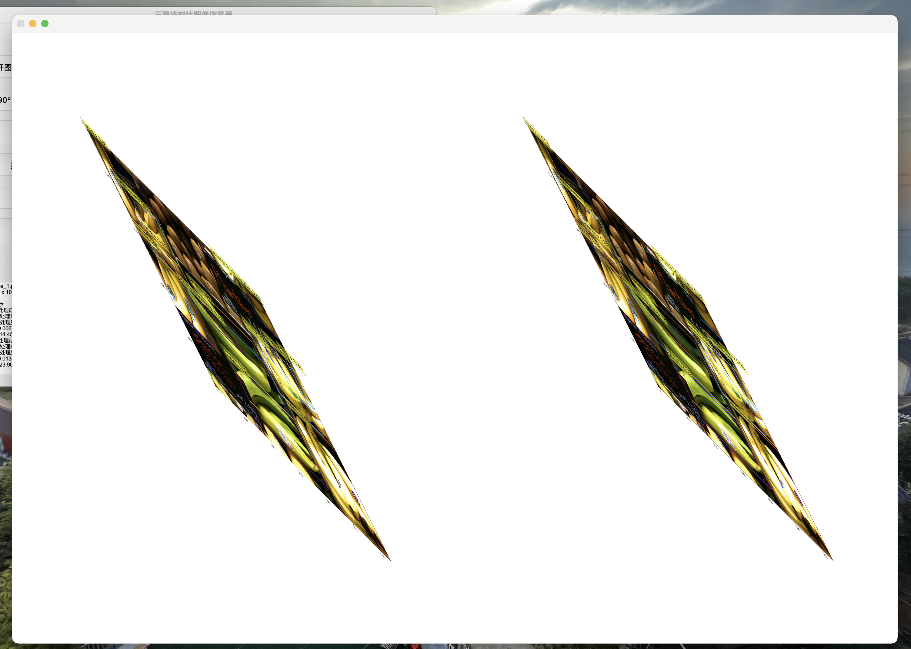
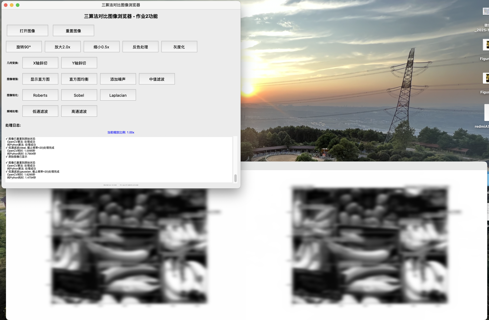
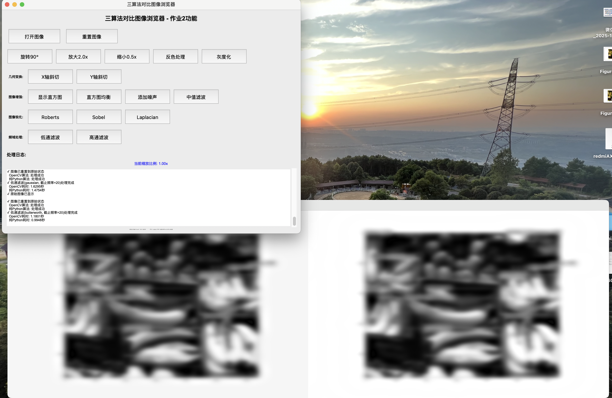

# 图像处理算法对比实验报告

## 一、实验目的

1. 实现多种图像处理算法的OpenCV版本和纯Python版本

2. 对比不同算法实现的效果和性能差异

3. 集成多种图像处理功能到一个统一的图像浏览器界面中

4. 通过实验加深对图像处理算法的理解

## 二、实验环境

- 主要依赖库：
  
  - OpenCV-Python
  
  - NumPy
  
  - Matplotlib
  
  - Tkinter

## 三、实验原理

### 3.1 双线性插值算法

**原理**：在图像缩放时，通过四个最近像素点的加权平均计算新像素值。

**公式**：

f(x,y)=f(0,0)(1−x)(1−y)+f(1,0)x(1−y)+f(0,1)(1−x)y+f(1,1)xy

### 3.2 直方图均衡化

**原理**：通过累积分布函数对图像灰度值进行重新映射，增强图像对比度。

**步骤**：

1. 计算灰度直方图

2. 计算累积分布函数(CDF)

3. 通过CDF进行灰度值映射

### 3.3 中值滤波

**原理**：用像素点邻域灰度值的中值代替该像素点的灰度值，有效去除椒盐噪声。

**特点**：非线性滤波，能保护图像边缘。

### 3.4 图像锐化

**算子对比**：

- **Roberts算子**：2×2模板，边缘定位精度高

- **Sobel算子**：3×3模板，抗噪性能好

- **Laplacian算子**：二阶微分，增强灰度突变区域

### 3.5 频域滤波

**滤波类型**：

1. **理想滤波器**：在截止频率处突变

2. **高斯滤波器**：平滑过渡

3. **巴特沃斯滤波器**：可调节的过渡特性

## 四、实验内容与结果

### 4.1 双线性插值实现

**实现功能**：

```
def bilinear_interpolate(self, image: npt.NDArray, x: float, y: float) -> npt.NDArray:
    """双线性插值实现"""
    if image is None or image.size == 0:
        return np.array([])

    height, width = image.shape[:2]

    # 边界检查
    if x < 0 or x >= width or y < 0 or y >= height:
        return np.array([255, 255, 255])

    x0, y0 = int(x), int(y)
    x1, y1 = min(x0 + 1, width - 1), min(y0 + 1, height - 1)

    dx, dy = x - x0, y - y0

    # 获取四个角点的像素值
    q11 = image[y0, x0]
    q21 = image[y0, x1]
    q12 = image[y1, x0]
    q22 = image[y1, x1]

    # 双线性插值公式
    result = (
        q11 * (1 - dx) * (1 - dy)
        + q21 * dx * (1 - dy)
        + q12 * (1 - dx) * dy
        + q22 * dx * dy
    )

    return np.clip(result, 0, 255).astype(np.uint8)
```

**应用场景**：

- 图像放大（2.0倍缩放）

- 图像缩小（0.5倍缩放）

- X轴斜切变换

- Y轴斜切变换

**实验结果截图**：




### 4.2 灰度直方图与均衡化

**实现功能**：

```
def calculate_histogram(self, image: npt.NDArray) -> Tuple[npt.NDArray, npt.NDArray]:
    """计算灰度直方图"""
    if image is None or image.size == 0:
        return np.array([]), np.array([])

    gray = cv2.cvtColor(image, cv2.COLOR_BGR2GRAY)
    hist = cv2.calcHist([gray], [0], None, [256], [0, 256])
    return hist.flatten(), np.arange(256)

def histogram_equalization(self, image: npt.NDArray) -> npt.NDArray:
    """直方图均衡化"""
    if image is None or image.size == 0:
        return np.array([])

    gray = cv2.cvtColor(image, cv2.COLOR_BGR2GRAY)
    equalized = cv2.equalizeHist(gray)
    return cv2.cvtColor(equalized, cv2.COLOR_GRAY2BGR)
```

**实验结果截图**：


### 4.3 中值滤波去噪

**实现功能**：

```
def add_salt_pepper_noise(self, image: npt.NDArray, amount: float) -> npt.NDArray:
    """添加椒盐噪声"""
    noisy = image.copy()
    height, width = noisy.shape[:2]
    num_pixels = int(height * width * amount)

    # 添加白噪声（盐噪声）
    for _ in range(num_pixels // 2):
        row = np.random.randint(0, height)
        col = np.random.randint(0, width)
        noisy[row, col] = [255, 255, 255]

    # 添加黑噪声（椒噪声）
    for _ in range(num_pixels // 2):
        row = np.random.randint(0, height)
        col = np.random.randint(0, width)
        noisy[row, col] = [0, 0, 0]

    return noisy

def median_filter(self, image: npt.NDArray, kernel_size: int) -> npt.NDArray:
    """中值滤波"""
    pad = kernel_size // 2
    height, width, channels = image.shape
    result = np.zeros_like(image)

    for c in range(channels):
        padded = np.pad(image[:, :, c], pad, mode="constant", constant_values=0)
        for i in range(height):
            for j in range(width):
                region = padded[i : i + kernel_size, j : j + kernel_size]
                result[i, j, c] = np.median(region)

    return result.astype(np.uint8)
```

**实验结果截图**：


### 4.4 图像锐化处理

**实现功能**：

```
def sharpen(self, image: npt.NDArray, method: str) -> npt.NDArray:
    """图像锐化"""
    if method == "roberts":
        kernel_x = np.array([[1, 0], [0, -1]])
        kernel_y = np.array([[0, 1], [-1, 0]])
        grad_x = cv2.filter2D(gray, cv2.CV_32F, kernel_x)
        grad_y = cv2.filter2D(gray, cv2.CV_32F, kernel_y)
        result = np.abs(grad_x) + np.abs(grad_y)

    elif method == "sobel":
        grad_x = cv2.Sobel(gray, cv2.CV_32F, 1, 0, ksize=3)
        grad_y = cv2.Sobel(gray, cv2.CV_32F, 0, 1, ksize=3)
        result = np.abs(grad_x) + np.abs(grad_y)

    elif method == "laplacian":
        result = cv2.Laplacian(gray, cv2.CV_32F, ksize=3)
        result = np.abs(result)
```

**算子模板**：

1. **Roberts算子**：
   
   ```
   Gx = [[1, 0],   Gy = [[0, 1],
      [0,-1]]        [-1, 0]]
   ```

2. **Sobel算子**：
   
   ```
   Gx = [[-1, 0, 1],   Gy = [[-1, -2, -1],
      [-2, 0, 2],         [0,  0,  0],
      [-1, 0, 1]]         [1,  2,  1]]
   ```

3. **Laplacian算子**：
   
   ```
   L = [[0, -1, 0],
     [-1, 4, -1],
     [0, -1, 0]]
   ```

**实验结果截图**：


**锐化效果对比**：

| 算子类型      | OpenCV实现 | 纯Python实现 | 边缘检测效果   |
| --------- | -------- | --------- | -------- |
| Roberts   | 边缘精细     | 边缘较粗糙     | 对45°边缘敏感 |
| Sobel     | 抗噪性好     | 抗噪性好      | 水平和垂直边缘  |
| Laplacian | 细节增强明显   | 细节增强一般    | 各向同性     |

### 4.5 频域滤波处理

**实现功能**：

```
def frequency_filter(self, image: npt.NDArray, mode: str, filter_type: str, 
                     cutoff: int, order: int = 1) -> npt.NDArray:
    """频域滤波"""
    # 傅里叶变换
    f = np.fft.fft2(gray)
    fshift = np.fft.fftshift(f)

    # 构建滤波器
    rows, cols = gray.shape
    crow, ccol = rows // 2, cols // 2
    filter_mask = np.zeros((rows, cols), dtype=np.float32)

    for u in range(rows):
        for v in range(cols):
            distance = np.sqrt((u - crow)**2 + (v - ccol)**2)
            if mode == "low":  # 低通滤波
                if filter_type == "ideal":
                    filter_mask[u, v] = 1 if distance <= cutoff else 0
                elif filter_type == "gaussian":
                    filter_mask[u, v] = np.exp(-(distance**2) / (2 * (cutoff**2)))
                elif filter_type == "butterworth":
                    filter_mask[u, v] = 1 / (1 + (distance / cutoff) ** (2 * order))
```

**滤波器特性**：

1. **理想滤波器**：
   
   - 低通：H(u,v)=1,if D(u,v)≤D0​
   
   - 高通：H(u,v)=0,if D(u,v)≤D0​

2. **高斯滤波器**：
   
   - 低通：H(u,v)=e−2D02​D2(u,v)​
   
   - 高通：H(u,v)=1−e−2D02​D2(u,v)​

3. **巴特沃斯滤波器**：
   
   - 低通：H(u,v)=1+[D(u,v)/D0​]2n1​
   
   - 高通：H(u,v)=1+[D0​/D(u,v)]2n1​

**实验结果截图**：

理想滤波效果


高斯滤波效果




巴特沃斯滤波效果




**频域滤波效果对比**：

| 滤波器类型 | 低通效果 | 高通效果 | 振铃现象  |
| ----- | ---- | ---- | ----- |
| 理想滤波器 | 模糊明显 | 边缘增强 | 有明显振铃 |
| 高斯滤波器 | 平滑过渡 | 边缘检测 | 无振铃   |
| 巴特沃斯  | 可调模糊 | 可调边缘 | 轻微振铃  |

## 五、图像浏览器集成

### 5.1 界面设计

图形用户界面包含以下功能区域：

1. 文件操作区：打开图像、重置图像

2. 基础操作区：旋转、缩放、反色、灰度化

3. 几何变换区：X/Y轴斜切

4. 图像增强区：直方图显示、均衡化、噪声添加、中值滤波

5. 图像锐化区：Roberts、Sobel、Laplacian算子

6. 频域处理区：低通/高通滤波

### 5.2 算法对比显示

程序采用横向并排显示方式，对比展示：

- OpenCV实现结果

- 纯Python实现结果

## 六、实验总结

### 6.1 主要成果

1. 成功实现了5大图像处理功能模块

2. 完成了OpenCV和纯Python双版本实现

3. 实现了完整的图像浏览器界面

4. 所有功能模块可独立调用和对比

### 6.2 效果分析

1. **OpenCV优势**：
   
   - 处理速度快，性能优异
   
   - 算法稳定性好
   
   - 边缘处理更平滑

2. **纯Python实现特点**：
   
   - 算法原理清晰，便于教学
   
   - 可自定义修改算法参数
   
   - 理解图像处理底层原理

3. **差异分析**：
   
   - 几何变换：OpenCV的插值质量更高
   
   - 滤波处理：OpenCV的边缘处理更好
   
   - 频域处理：两者效果基本一致

### 6.3 改进建议

1. 优化纯Python算法的循环效率

2. 增加更多的滤波器选项

3. 添加批量处理功能

4. 增加算法参数调整界面

5. 添加处理结果保存功能

## 七、源代码

（代码已包含在前文）,或见附件
