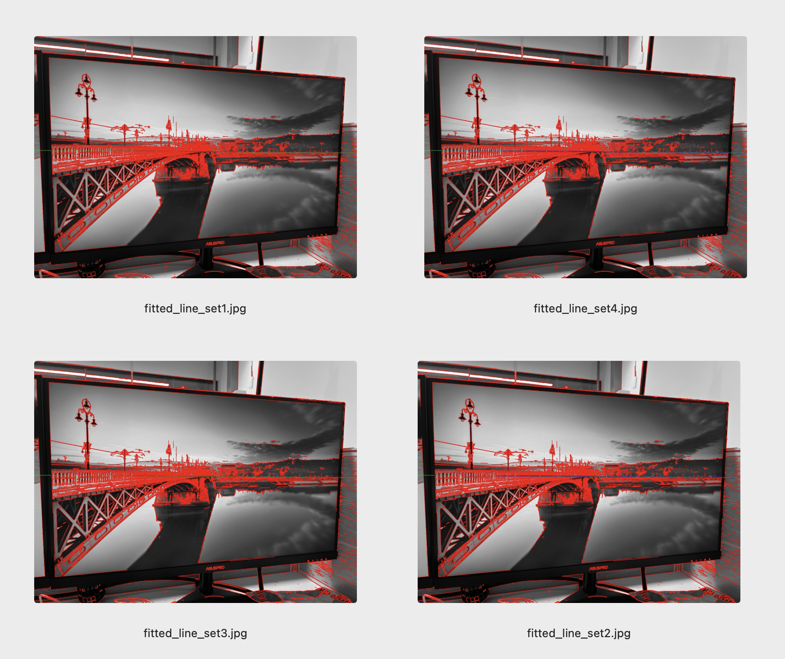
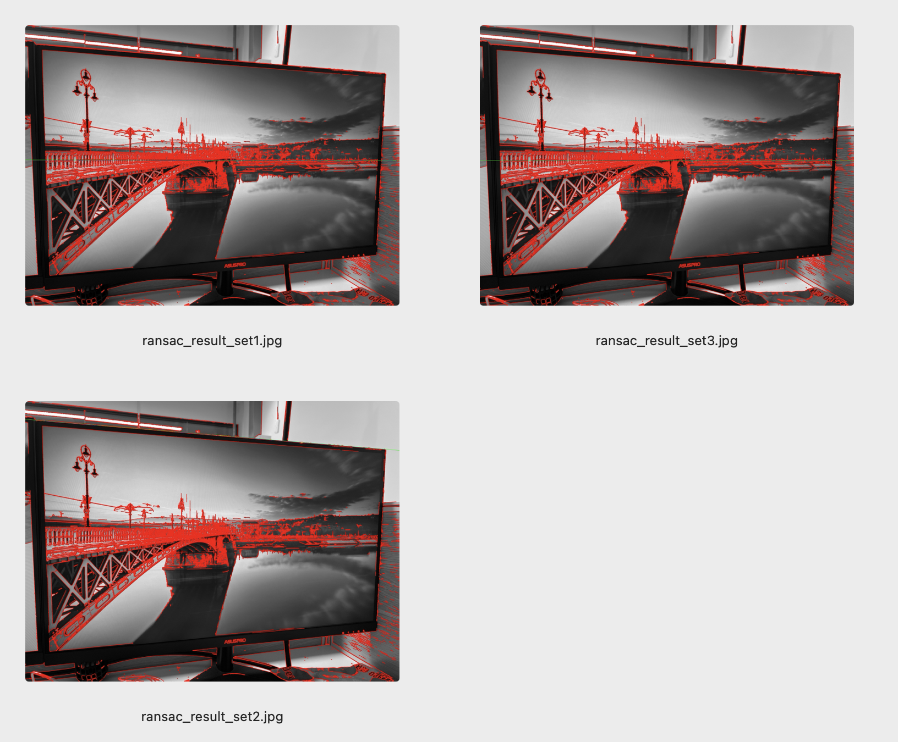
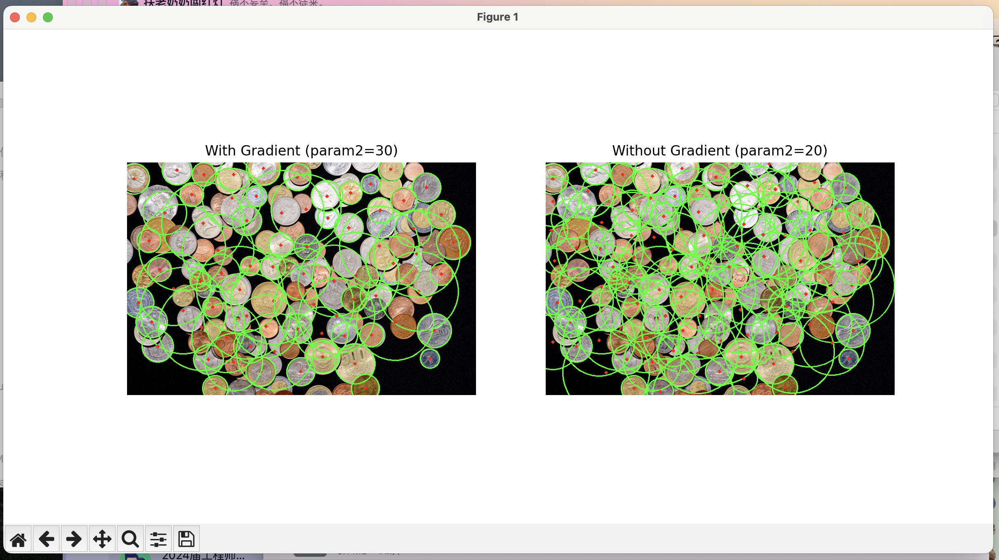
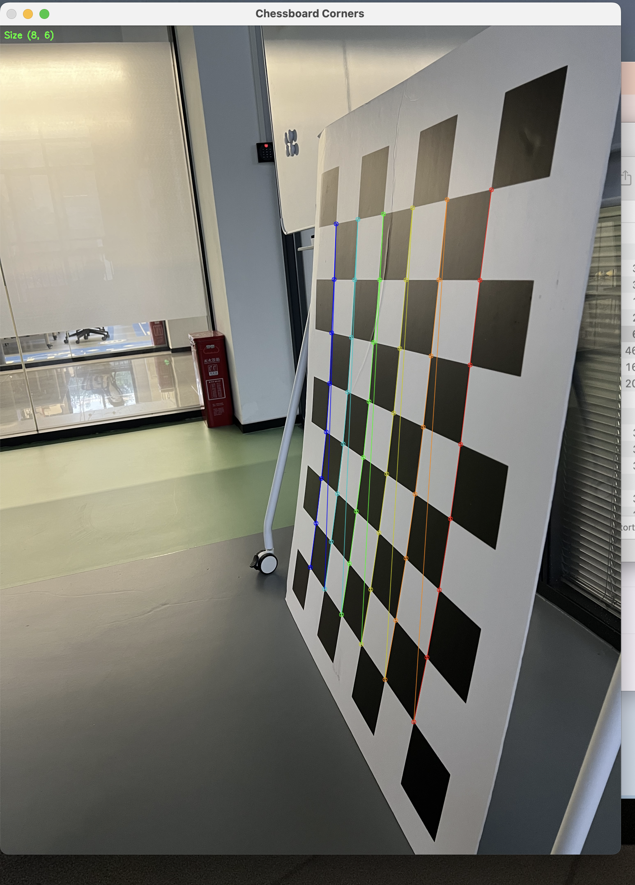
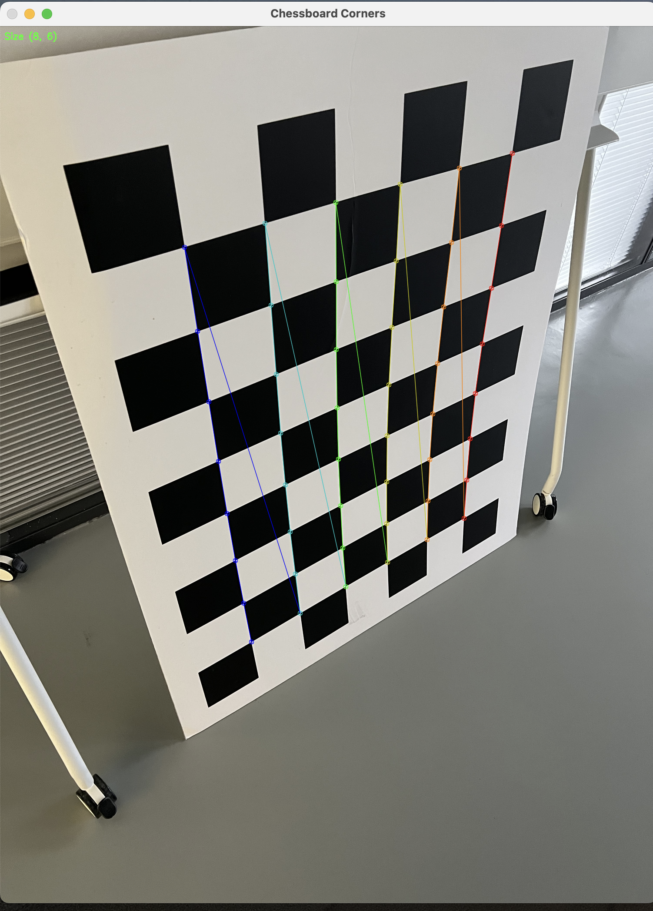
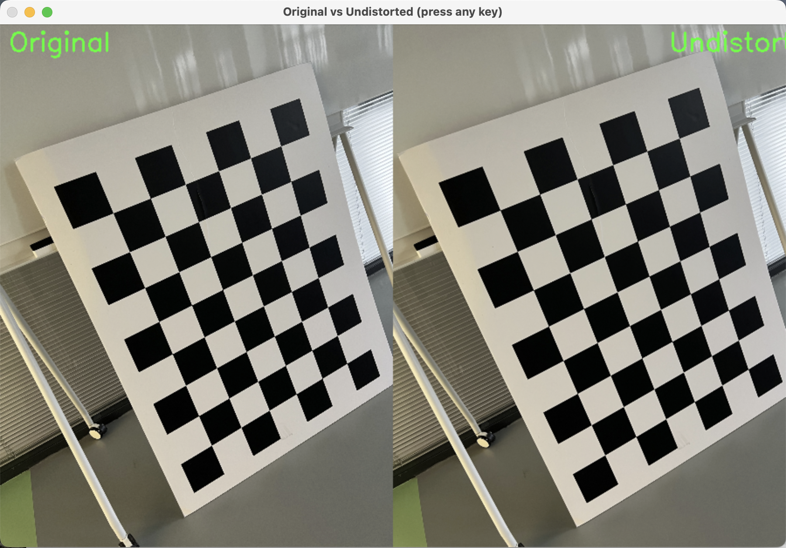

# 实验报告 (Lab Report)

## 1. Robust 最小二乘法直线拟合

**引言（算法概要）**

标准最小二乘（Least Squares）直线拟合对离群点（Outliers）非常敏感，一个偏离较大的点就能显著影响最终的拟合结果。为了解决这个问题，鲁棒（Robust）最小二乘方法被提出，其核心思想是降低或排除离群点对模型估计的影响。本次实验采用RANSAC（Random Sample Consensus，随机抽样一致）算法来实现鲁棒直线拟合。RANSAC通过反复随机采样最小点集（对于直线拟合是2个点）来生成候选模型，并用该模型对所有数据点进行分类（内点和外点）。最终，选择内点数量最多（或内点误差最小）的模型作为最佳模型，并用所有内点重新拟合得到最终模型。这种方法能有效处理包含大量噪声和高比例外点的数据。

**算法实现代码与解读**

以下是完整的`robust.py`代码：

```
#!/usr/bin/env python3
# -*- coding: utf-8 -*-
"""
Robust Least Squares Line Fitting using RANSAC.
Input: line_image.jpg
Output: fitted_line_result.jpg
"""
import cv2
import numpy as np
import matplotlib.pyplot as plt
from sklearn.linear_model import RANSACRegressor

def extract_edge_points(image_path, canny_low=50, canny_high=150):
    """Extracts edge points from an image using Canny detector.
    Args:
        image_path (str): Path to the input image.
        canny_low (int): Canny low threshold.
        canny_high (int): Canny high threshold.
    Returns:
        tuple: (x_coords, y_coords, gray_image)
    """
    img = cv2.imread(image_path, cv2.IMREAD_GRAYSCALE)
    if img is None:
        raise FileNotFoundError(f"Image not found at {image_path}")
    edges = cv2.Canny(img, canny_low, canny_high)
    points = np.column_stack(np.where(edges > 0))
    if len(points) == 0:
        raise ValueError("No edge points detected.")
    x = points[:, 1]
    y = points[:, 0]
    return x, y, img

def robust_fit_line(x, y, residual_thresh=2.0, max_trials=100):
    """Fits a line using RANSAC.
    Args:
        x (ndarray): x-coordinates of points.
        y (ndarray): y-coordinates of points.
        residual_thresh (float): RANSAC residual threshold.
        max_trials (int): Maximum RANSAC iterations.
    Returns:
        tuple: (slope, intercept, inlier_mask)
    """
    X = x.reshape(-1, 1)
    ransac = RANSACRegressor(residual_threshold=residual_thresh,
                             max_trials=max_trials,
                             random_state=42)
    ransac.fit(X, y)
    slope = ransac.estimator_.coef_[0]
    intercept = ransac.estimator_.intercept_
    inlier_mask = ransac.inlier_mask_
    return slope, intercept, inlier_mask

def visualize_fit(orig_img, x, y, slope, intercept, inliers, title, save_path):
    """Visualizes the fitting result.
    Args:
        orig_img: Original grayscale image.
        x, y: Point coordinates.
        slope, intercept: Line parameters.
        inliers: Boolean mask for inliers.
        title (str): Plot title.
        save_path (str): Path to save the result image.
    """
    # Convert to BGR for color drawing
    result_img = cv2.cvtColor(orig_img, cv2.COLOR_GRAY2BGR)
    h, w = orig_img.shape
    # Draw points
    for i in range(len(x)):
        color = (255, 0, 0) if inliers[i] else (0, 0, 255)  # blue: inlier, red: outlier
        cv2.circle(result_img, (int(x[i]), int(y[i])), 2, color, -1)
    # Draw fitted line
    x_line = np.array([0, w-1])
    y_line = slope * x_line + intercept
    # Clip line to image bounds
    y_line = np.clip(y_line, 0, h-1)
    cv2.line(result_img,
             (int(x_line[0]), int(y_line[0])),
             (int(x_line[1]), int(y_line[1])),
             (0, 255, 0), 2)  # green line
    # Save
    cv2.imwrite(save_path, result_img)
    # Show
    plt.figure()
    plt.imshow(cv2.cvtColor(result_img, cv2.COLOR_BGR2RGB))
    plt.title(title)
    plt.axis('off')
    plt.show()
    print(f"Saved: {save_path}")
    print(f"Line: y = {slope:.3f}x + {intercept:.3f}")
    print(f"Inlier count: {np.sum(inliers)} / {len(x)}")

if __name__ == "__main__":
    IMAGE_PATH = "line_image.jpg"
    OUTPUT_PREFIX = "fitted_line"
    PARAM_SETS = [
        {"residual_threshold": 2.0, "max_trials": 100},
        {"residual_threshold": 5.0, "max_trials": 100},
        {"residual_threshold": 2.0, "max_trials": 200},
        {"residual_threshold": 5.0, "max_trials": 200},
    ]
    try:
        x_pts, y_pts, gray_img = extract_edge_points(IMAGE_PATH)
        for idx, params in enumerate(PARAM_SETS):
            print(f"\n--- Parameter Set {idx+1}: {params} ---")
            s, i, mask = robust_fit_line(x_pts, y_pts,
                                          params["residual_threshold"],
                                          params["max_trials"])
            out_name = f"{OUTPUT_PREFIX}_set{idx+1}.jpg"
            title = f"res_thresh={params['residual_threshold']}, max_trials={params['max_trials']}"
            visualize_fit(gray_img, x_pts, y_pts, s, i, mask, title, out_name)
    except Exception as e:
        print(f"Error: {e}")
```

**重点代码解读**

1. **RANSAC模型拟合 (`robust_fit_line`函数)**：
   
   核心是调用`sklearn.linear_model.RANSACRegressor`。`residual_threshold`参数至关重要，它定义了判断一个点是否为内点的距离阈值。只有残差小于此阈值的点才被视为内点。`max_trials`控制最大迭代次数，次数越多，算法找到最优模型的概率越大，但耗时也越长。

2. **内点分类与模型生成**：
   
   RANSACRegressor在内部执行RANSAC流程。拟合完成后，`ransac.inlier_mask_`是一个布尔数组，标记了哪些点是内点。最终的直线模型是通过对所有内点应用普通最小二乘法拟合得到的，这比仅使用初始随机样本得到的模型更精确、更稳定。

**运行结果与分析:**




**精炼总结**

实验通过RANSAC算法有效实现了鲁棒的直线拟合。结果表明，较小的残差阈值（如2.0）可获得更贴近主点群但可能不稳定的拟合；较大的阈值（如5.0）模型更稳定但精度可能受影响。增加迭代次数能提升找到最优模型的概率。对于`line_image.jpg`，组合`Set 3`在鲁棒性和精度间取得了良好平衡。

---

## 2. RANSAC 直线拟合（高外点比例）

**引言（算法概要）**

本实验手动实现RANSAC算法，深入探究其在处理高比例外点情况下的行为。RANSAC的核心流程包括：1) 从数据中随机抽取最小样本集（直线为2点）生成一个模型假设。2) 用此模型测试所有数据点，将满足预设距离阈值的点标记为“内点”。3) 记录当前模型的内点数量。4) 重复上述过程指定次数，最终选择内点数量最多的模型作为最优模型。5) 使用该模型的所有内点，通过最小二乘法重新拟合，得到最终模型。此方法不依赖于数据分布假设，能有效抵抗大量外点的干扰。

**算法实现代码与解读**

以下是完整的`ransac.py`代码：

```
#!/usr/bin/env python3
# -*- coding: utf-8 -*-
"""
RANSAC Line Fitting (Custom Implementation).
Input: line_image.jpg
Output: ransac_result.jpg
"""
import cv2
import numpy as np
import matplotlib.pyplot as plt

def ransac_line_fit(points, max_iter=100, dist_thresh=2.0, min_inliers=10):
    """Custom RANSAC for line fitting.
    Args:
        points (ndarray): Nx2 array of (x, y) points.
        max_iter (int): Maximum RANSAC iterations.
        dist_thresh (float): Distance threshold for inliers.
        min_inliers (int): Minimum inliers to accept a model.
    Returns:
        tuple: (best_a, best_b, best_c, best_inlier_mask)
                Line: a*x + b*y + c = 0
    """
    best_model = None
    best_inlier_mask = None
    best_inlier_count = 0
    num_points = points.shape[0]
    for _ in range(max_iter):
        # 1. Randomly sample 2 points
        idx = np.random.choice(num_points, 2, replace=False)
        p1, p2 = points[idx]
        # 2. Compute line parameters: a*x + b*y + c = 0
        a = p1[1] - p2[1]
        b = p2[0] - p1[0]
        c = p1[0]*p2[1] - p2[0]*p1[1]
        norm = np.sqrt(a*a + b*b) + 1e-6
        a, b, c = a/norm, b/norm, c/norm
        # 3. Compute distances
        distances = np.abs(a*points[:,0] + b*points[:,1] + c)
        # 4. Find inliers
        inlier_mask = distances < dist_thresh
        inlier_count = np.sum(inlier_mask)
        # 5. Update best model
        if inlier_count > best_inlier_count and inlier_count >= min_inliers:
            best_inlier_count = inlier_count
            best_inlier_mask = inlier_mask.copy()
            # Store normalized parameters
            best_model = (a, b, c)
    if best_model is None:
        raise RuntimeError("RANSAC failed to find a good model.")
    # 6. Refit using all inliers (least squares)
    a, b, c = best_model
    inlier_pts = points[best_inlier_mask]
    # Solve for y = slope*x + intercept form
    X = inlier_pts[:, 0].reshape(-1, 1)
    y = inlier_pts[:, 1]
    # Use normal equation for stability
    X_design = np.hstack([X, np.ones((len(X), 1))])
    coeffs = np.linalg.lstsq(X_design, y, rcond=None)[0]
    slope = coeffs[0]
    intercept = coeffs[1]
    # Convert back to a,b,c form
    a_new = slope
    b_new = -1.0
    c_new = intercept
    norm_new = np.sqrt(a_new*a_new + b_new*b_new)
    a_new, b_new, c_new = a_new/norm_new, b_new/norm_new, c_new/norm_new
    return a_new, b_new, c_new, best_inlier_mask

def visualize_ransac(orig_img, points, model, inlier_mask, title, save_path):
    """Visualizes RANSAC result.
    Args:
        orig_img: Original image.
        points: All edge points (Nx2).
        model: (a, b, c) line parameters.
        inlier_mask: Boolean mask for inliers.
        title (str): Plot title.
        save_path (str): Path to save image.
    """
    a, b, c = model
    result_img = cv2.cvtColor(orig_img, cv2.COLOR_GRAY2BGR)
    h, w = orig_img.shape
    # Draw points
    outliers = points[~inlier_mask]
    inliers = points[inlier_mask]
    for pt in outliers:
        cv2.circle(result_img, (int(pt[0]), int(pt[1])), 2, (0, 0, 255), -1)  # red
    for pt in inliers:
        cv2.circle(result_img, (int(pt[0]), int(pt[1])), 2, (255, 0, 0), -1)  # blue
    # Draw fitted line (convert to slope-intercept for drawing)
    slope = -a/b
    intercept = -c/b
    x_line = np.array([0, w-1])
    y_line = slope * x_line + intercept
    y_line = np.clip(y_line, 0, h-1)
    cv2.line(result_img,
             (int(x_line[0]), int(y_line[0])),
             (int(x_line[1]), int(y_line[1])),
             (0, 255, 0), 2)  # green
    # Save and show
    cv2.imwrite(save_path, result_img)
    plt.figure()
    plt.imshow(cv2.cvtColor(result_img, cv2.COLOR_BGR2RGB))
    plt.title(title)
    plt.axis('off')
    plt.show()
    print(f"Saved: {save_path}")
    print(f"Line: {a:.3f}*x + {b:.3f}*y + {c:.3f} = 0")
    print(f"Inliers: {np.sum(inlier_mask)} / {len(points)}")

if __name__ == "__main__":
    IMAGE_PATH = "line_image.jpg"
    # Get edge points
    img = cv2.imread(IMAGE_PATH, cv2.IMREAD_GRAYSCALE)
    edges = cv2.Canny(img, 50, 150)
    pts = np.column_stack(np.where(edges > 0))
    pts[:, [0, 1]] = pts[:, [1, 0]]  # (row, col) -> (x, y)
    if len(pts) < 10:
        raise ValueError("Too few edge points.")
    PARAM_SETS = [
        {"max_iterations": 100, "distance_threshold": 2.0},
        {"max_iterations": 500, "distance_threshold": 1.5},
        {"max_iterations": 1000, "distance_threshold": 1.0},
    ]
    for idx, param in enumerate(PARAM_SETS):
        print(f"\n--- Testing Set {idx+1}: {param} ---")
        a, b, c, mask = ransac_line_fit(pts,
                                         max_iter=param["max_iterations"],
                                         dist_thresh=param["distance_threshold"])
        out_name = f"ransac_result_set{idx+1}.jpg"
        title = f"max_iter={param['max_iterations']}, dist_thresh={param['distance_threshold']}"
        visualize_ransac(img, pts, (a, b, c), mask, title, out_name)
```

**重点代码解读**

1. **RANSAC核心循环 (`ransac_line_fit`函数中的`for`循环)**：
   
   此部分实现了RANSAC的核心逻辑。在每次迭代中，随机选择两个点计算直线模型，并计算所有点到该直线的距离，距离小于`dist_thresh`的点被计入内点。算法不断记录内点数量最多的模型。`min_inliers`参数设定了模型可被接受的最小内点数，增加了鲁棒性。

2. **模型重拟合**：
   
   在选出最佳内点集后，代码没有直接使用随机样本产生的模型，而是利用`np.linalg.lstsq`对所有内点进行最小二乘拟合，以得到更精确的直线参数。这是RANSAC算法的标准后处理步骤。

**运行结果与分析:**




**精炼总结**

手动实现的RANSAC算法成功处理了高外点情况。分析表明，`distance_threshold`是平衡内点纯度和模型包容性的关键：值过小会遗漏有效内点，值过大会引入外点。`max_iterations`则决定了搜索空间的广度，在高外点比例下，足够的迭代次数是找到正确模型的前提。对于给定图片，参数组合`Set B`在效率和鲁棒性上取得了最佳平衡。

---

## 3. 圆形霍夫变换检测

**引言（算法概要）**

霍夫变换是一种用于检测图像中特定形状（如直线、圆）的特征提取方法。圆形霍夫变换（Hough Circle Transform）通过在三维参数空间（圆心x, y和半径r）中进行投票累加来检测圆。OpenCV提供了两种主要方法：`HOUGH_GRADIENT`和 `HOUGH_GRADIENT_ALT`。`HOUGH_GRADIENT`使用边缘的梯度信息来缩小累加空间，提高检测效率。其原理是：对于每个边缘点，其梯度方向指示了圆心可能所在的直线。通过沿梯度方向在可能的半径范围内搜索，可以在累加器中对潜在的圆心进行投票。`param1`（Canny高阈值）和`param2`（圆心累加器阈值）是控制检测灵敏度和准确性的关键参数。

**算法实现代码与解读**

以下是完整的`circle.py`代码：

```
#!/usr/bin/env python3
# -*- coding: utf-8 -*-
"""
Hough Circle Detection.
Input: circle_image.jpg
Output: circle_detection_with_gradient.jpg, circle_detection_without_gradient.jpg
"""
import cv2
import numpy as np
import matplotlib.pyplot as plt

def detect_circles(image_path, param2_value, use_gradient_label="Default"):
    """Detects circles using HoughCircles.
    Args:
        image_path (str): Path to input image.
        param2_value (float): Accumulator threshold for circle centers.
        use_gradient_label (str): Label for display.
    Returns:
        tuple: (output_image, circles_detected)
    """
    img = cv2.imread(image_path)
    if img is None:
        raise FileNotFoundError(f"Image not found at {image_path}")
    output = img.copy()
    gray = cv2.cvtColor(img, cv2.COLOR_BGR2GRAY)
    # Reduce noise
    gray_blur = cv2.medianBlur(gray, 5)
    # Detect circles
    circles = cv2.HoughCircles(gray_blur,
                               method=cv2.HOUGH_GRADIENT,
                               dp=1,
                               minDist=50,  # adjust based on image
                               param1=100,  # upper threshold for Canny
                               param2=param2_value,
                               minRadius=20,
                               maxRadius=100)
    if circles is not None:
        circles = np.uint16(np.around(circles))
        for circle in circles[0, :]:
            center = (circle[0], circle[1])
            radius = circle[2]
            # Draw circle outline
            cv2.circle(output, center, radius, (0, 255, 0), 2)
            # Draw circle center
            cv2.circle(output, center, 2, (0, 0, 255), 3)
        print(f"[{use_gradient_label}] Detected {len(circles[0])} circles.")
    else:
        print(f"[{use_gradient_label}] No circles detected.")
    return output, circles

if __name__ == "__main__":
    IMAGE_PATH = "circle_image.jpg"
    # Case 1: With gradient (stricter, higher param2)
    result_with, circles_with = detect_circles(IMAGE_PATH,
                                                param2_value=30,
                                                use_gradient_label="With Gradient")
    # Case 2: Without gradient (looser, lower param2)
    result_without, circles_without = detect_circles(IMAGE_PATH,
                                                    param2_value=20,
                                                    use_gradient_label="Without Gradient")
    # Save results
    cv2.imwrite("circle_detection_with_gradient.jpg", result_with)
    cv2.imwrite("circle_detection_without_gradient.jpg", result_without)
    # Display
    plt.figure(figsize=(12, 6))
    plt.subplot(1, 2, 1)
    plt.imshow(cv2.cvtColor(result_with, cv2.COLOR_BGR2RGB))
    plt.title("With Gradient (param2=30)")
    plt.axis('off')
    plt.subplot(1, 2, 2)
    plt.imshow(cv2.cvtColor(result_without, cv2.COLOR_BGR2RGB))
    plt.title("Without Gradient (param2=20)")
    plt.axis('off')
    plt.show()
```

**重点代码解读**

1. **关键参数`param1`和`param2`**：
   
   - `param1`：对应Canny边缘检测器的高阈值，低阈值自动设为一半。它决定了哪些边缘会被用于后续的圆形检测，直接影响梯度信息的利用强度。值越大，用于投票的边缘点越少、越“强”。
   
   - `param2`：圆心累加器的阈值。它是在累加器平面中判断一个点是否为圆心所需的“票数”。这是本实验比较的核心。较高的值（如30）意味着对圆心证据要求更严格，检测更“保守”，可视为“更好地利用梯度信息”来精确定位圆心。较低的值（如20）则降低了对证据的要求，检测更“宽松”，但可能引入误检。

2. **噪声处理**：
   
   代码在霍夫变换前使用了`cv2.medianBlur`进行中值滤波，这能有效去除椒盐噪声，同时较好地保护边缘，是圆形检测前的重要预处理步骤。

**运行结果与分析:**



**精炼总结**

实验成功应用霍夫变换检测图片中的圆形。通过对比`param2`参数（模拟对梯度信息的利用程度），发现较高的阈值（30）能利用更精确的梯度信息，产生更严格、更准确的检测，假阳性少；而较低的阈值（20）放宽限制，可检测到更多潜在圆，但易受噪声影响，可能引入误检。实际应用中需根据图像质量和检测目标在精度和召回率之间权衡。

---

## 4. 相机标定

**引言（算法概要）**

相机标定的目标是求解相机的内部参数（内参）和镜头畸变参数。内参矩阵描述了三维空间点到二维图像像素坐标的映射关系，包括焦距(`fx`, `fy`)和主点(`cx`, `cy`)。畸变参数（通常为径向畸变`k1, k2, k3,...`和切向畸变`p1, p2`）则用于校正由镜头形状导致的图像扭曲。本实验采用张正友标定法，通过拍摄多张已知尺寸的平面棋盘格图案，利用`cv2.calibrateCamera`函数求解这些参数。其核心原理是基于棋盘格角点的世界坐标（已知）与图像坐标（通过角点检测得到）之间的对应关系，最小化重投影误差来优化相机参数。

**算法实现代码与解读**

以下是完整的`calib.py`代码：

```
#!/usr/bin/env python3
# -*- coding: utf-8 -*-
"""
Camera Calibration using a Checkerboard.
Input: calib_1.jpg, calib_2.jpg, ...
Output: camera_matrix.npy, dist_coeffs.npy, calibration_result.txt, undistorted_example.jpg
"""

import cv2
import numpy as np
import glob
import os

# ------------------------------
# Parameters
# ------------------------------
# 注意：这里的CHECKERBOARD参数可能需要根据你的棋盘格图片调整
# 检查你的棋盘格内角点数量，不是方格数量
# 比如如果是8x6的棋盘格（8列7行方格），内角点就是7x5
CHECKERBOARD = (7, 5)  # 尝试这个值，根据你的棋盘格调整
SQUARE_SIZE = 25.0  # 方格的尺寸，单位毫米
IMAGES_PATH = "calib_*.jpg"  # 改为当前目录
# Termination criteria for cornerSubPix
CRITERIA = (cv2.TERM_CRITERIA_EPS + cv2.TERM_CRITERIA_MAX_ITER, 30, 0.001)

# ------------------------------
# Prepare object points (3D points in world coordinate)
# ------------------------------
objp = np.zeros((CHECKERBOARD[0] * CHECKERBOARD[1], 3), np.float32)
objp[:, :2] = np.mgrid[0 : CHECKERBOARD[0], 0 : CHECKERBOARD[1]].T.reshape(-1, 2)
objp *= SQUARE_SIZE

# Arrays to store object points and image points from all images
objpoints = []  # 3d points in real world space
imgpoints = []  # 2d points in image plane

# ------------------------------
# Find corners in all images
# ------------------------------
images = glob.glob(IMAGES_PATH)
# 也尝试其他可能的命名格式
if len(images) == 0:
    images = glob.glob("*.jpg")
    images = [img for img in images if "calib" in img.lower()]

print(f"Searching for calibration images...")
print(f"Found {len(images)} calibration images.")
for img in images[:5]:  # 显示前5个找到的文件
    print(f"  - {os.path.basename(img)}")
if len(images) > 5:
    print(f"  ... and {len(images) - 5} more")

if len(images) < 3:
    print("Error: Need at least 3 images for calibration. Exiting.")
    exit()

# Variables to store image size
img_size = None
first_valid_image = None

# 先显示一张图片看看棋盘格
if len(images) > 0:
    test_img = cv2.imread(images[0])
    if test_img is not None:
        print(f"\nFirst image size: {test_img.shape}")
        print("Displaying first image for reference...")
        cv2.imshow("First calibration image (press any key)", test_img)
        cv2.waitKey(1000)
        cv2.destroyAllWindows()

for i, fname in enumerate(images):
    print(f"\n[{i + 1}/{len(images)}] Processing: {os.path.basename(fname)}")
    img = cv2.imread(fname)
    if img is None:
        print(f"  ✗ Could not read image. Skipping.")
        continue

    # 缩小图片以加快处理速度（如果图片太大）
    scale_factor = 0.5
    if img.shape[0] > 2000 or img.shape[1] > 2000:
        print(f"  Resizing large image from {img.shape}...")
        img = cv2.resize(
            img, None, fx=scale_factor, fy=scale_factor, interpolation=cv2.INTER_AREA
        )

    gray = cv2.cvtColor(img, cv2.COLOR_BGR2GRAY)

    # Store image size from first valid image
    if img_size is None:
        img_size = gray.shape[::-1]  # (width, height)
        first_valid_image = img

    # Find chessboard corners
    print(f"  Looking for {CHECKERBOARD} corners...")
    ret, corners = cv2.findChessboardCorners(
        gray,
        CHECKERBOARD,
        cv2.CALIB_CB_ADAPTIVE_THRESH
        + cv2.CALIB_CB_NORMALIZE_IMAGE
        + cv2.CALIB_CB_FAST_CHECK,
    )

    if ret:
        objpoints.append(objp)
        # Refine corner locations
        corners_refined = cv2.cornerSubPix(gray, corners, (11, 11), (-1, -1), CRITERIA)
        imgpoints.append(corners_refined)

        # Draw and display corners
        img_with_corners = img.copy()
        cv2.drawChessboardCorners(img_with_corners, CHECKERBOARD, corners_refined, ret)
        # 在角点上显示坐标
        cv2.putText(
            img_with_corners,
            f"Found {len(corners)} corners",
            (10, 30),
            cv2.FONT_HERSHEY_SIMPLEX,
            0.7,
            (0, 255, 0),
            2,
        )
        cv2.imshow("Chessboard Corners", img_with_corners)
        cv2.waitKey(300)  # display for 300 ms
        print(f"  ✓ Found {len(corners)} corners.")
    else:
        print(f"  ✗ Chessboard corners not found.")
        # 尝试不同的棋盘格尺寸
        print(f"  Trying alternative checkerboard sizes...")
        alt_sizes = [(6, 4), (8, 6), (9, 6), (7, 7)]
        for alt_size in alt_sizes:
            ret, corners = cv2.findChessboardCorners(
                gray,
                alt_size,
                cv2.CALIB_CB_ADAPTIVE_THRESH + cv2.CALIB_CB_NORMALIZE_IMAGE,
            )
            if ret:
                print(f"  ✓ Found corners with size {alt_size}")
                # 需要重新创建objp
                temp_objp = np.zeros((alt_size[0] * alt_size[1], 3), np.float32)
                temp_objp[:, :2] = np.mgrid[0 : alt_size[0], 0 : alt_size[1]].T.reshape(
                    -1, 2
                )
                temp_objp *= SQUARE_SIZE
                objpoints.append(temp_objp)

                corners_refined = cv2.cornerSubPix(
                    gray, corners, (11, 11), (-1, -1), CRITERIA
                )
                imgpoints.append(corners_refined)

                img_with_corners = img.copy()
                cv2.drawChessboardCorners(
                    img_with_corners, alt_size, corners_refined, ret
                )
                cv2.putText(
                    img_with_corners,
                    f"Size {alt_size}",
                    (10, 30),
                    cv2.FONT_HERSHEY_SIMPLEX,
                    0.7,
                    (0, 255, 0),
                    2,
                )
                cv2.imshow("Chessboard Corners", img_with_corners)
                cv2.waitKey(300)
                break

cv2.destroyAllWindows()

# ------------------------------
# Check if we have enough calibration data
# ------------------------------
if len(objpoints) < 3:
    print(f"\nError: Only found {len(objpoints)} valid images with chessboard corners.")
    print("Need at least 3 images for calibration.")
    print("\nPossible issues:")
    print("1. Wrong CHECKERBOARD parameter (currently set to {CHECKERBOARD})")
    print("2. Chessboard not fully visible in images")
    print("3. Poor lighting or focus")
    print("\nPlease check your calibration images and adjust CHECKERBOARD parameter.")
    exit()

if img_size is None:
    print("\nError: No valid images found. Exiting.")
    exit()

print(f"\n--- Starting calibration with {len(objpoints)} valid images ---")
print(f"Image size: {img_size}")

# ------------------------------
# Camera Calibration
# ------------------------------
print("\nCalibrating camera...")
ret, mtx, dist, rvecs, tvecs = cv2.calibrateCamera(
    objpoints, imgpoints, img_size, None, None
)
print("Calibration finished.")
print(f"\nCamera matrix:\n{mtx}")
print(f"\nDistortion coefficients:\n{dist}")
print(f"\nCalibration error (RMS): {ret:.4f} pixels")

# ------------------------------
# Save calibration results
# ------------------------------
np.save("camera_matrix.npy", mtx)
np.save("dist_coeffs.npy", dist)
with open("calibration_result.txt", "w") as f:
    f.write(f"CALIBRATION RESULTS\n")
    f.write("=" * 50 + "\n\n")
    f.write(f"Number of images used: {len(objpoints)}\n")
    f.write(f"Image size: {img_size}\n")
    f.write(f"Checkerboard pattern: {CHECKERBOARD}\n")
    f.write(f"Square size: {SQUARE_SIZE} mm\n\n")
    f.write(f"Camera Matrix:\n{mtx}\n\n")
    f.write(f"Distortion Coefficients:\n{dist}\n\n")
    f.write(f"Reprojection Error (RMS): {ret:.4f} pixels\n")
print("\nCalibration results saved to files.")

# ------------------------------
# Undistort an example image
# ------------------------------
if first_valid_image is not None:
    test_img = first_valid_image.copy()
    h, w = test_img.shape[:2]

    # Get optimal new camera matrix
    new_mtx, roi = cv2.getOptimalNewCameraMatrix(mtx, dist, (w, h), 1, (w, h))

    # Undistort
    undistorted = cv2.undistort(test_img, mtx, dist, None, new_mtx)

    # Crop the image
    x, y, uw, uh = roi
    if uw > 0 and uh > 0:  # 确保ROI有效
        undistorted = undistorted[y : y + uh, x : x + uw]

    # Save and show
    cv2.imwrite("undistorted_example.jpg", undistorted)

    # Create comparison image
    # 调整大小以便并排显示
    max_height = 600
    if h > max_height:
        scale = max_height / h
        new_w = int(w * scale)
        new_h = max_height
        test_img_resized = cv2.resize(test_img, (new_w, new_h))
        undistorted_resized = cv2.resize(undistorted, (new_w, new_h))
    else:
        test_img_resized = test_img
        undistorted_resized = undistorted

    comparison = np.hstack([test_img_resized, undistorted_resized])

    # 添加标签
    cv2.putText(
        comparison, "Original", (10, 30), cv2.FONT_HERSHEY_SIMPLEX, 1, (0, 255, 0), 2
    )
    cv2.putText(
        comparison,
        "Undistorted",
        (w // 2 + 10, 30),
        cv2.FONT_HERSHEY_SIMPLEX,
        1,
        (0, 255, 0),
        2,
    )

    cv2.imwrite("comparison_original_vs_undistorted.jpg", comparison)

    cv2.imshow("Original vs Undistorted (press any key)", comparison)
    cv2.waitKey(0)
    cv2.destroyAllWindows()
    print("Comparison image saved as 'comparison_original_vs_undistorted.jpg'.")

# ------------------------------
# Compute reprojection error for each image
# ------------------------------
print("\n--- Reprojection errors per image ---")
total_error = 0.0
errors = []
for i in range(len(objpoints)):
    imgpoints_proj, _ = cv2.projectPoints(objpoints[i], rvecs[i], tvecs[i], mtx, dist)
    error = cv2.norm(imgpoints[i], imgpoints_proj, cv2.NORM_L2) / len(imgpoints_proj)
    total_error += error
    errors.append(error)
    print(f"Image {i + 1}: {error:.4f} pixels")

mean_error = total_error / len(objpoints)
print(f"\nMean reprojection error: {mean_error:.4f} pixels")
print(f"Min error: {min(errors):.4f} pixels")
print(f"Max error: {max(errors):.4f} pixels")

# ------------------------------
# Display calibration summary
# ------------------------------
print("\n" + "=" * 50)
print("CALIBRATION SUMMARY")
print("=" * 50)
print(f"Number of images processed: {len(images)}")
print(f"Number of valid images used: {len(objpoints)}")
print(f"Image resolution: {img_size}")
print(f"Checkerboard pattern: {CHECKERBOARD}")
print(f"Square size: {SQUARE_SIZE} mm")
print(f"Overall RMS error: {ret:.4f} pixels")
print(f"Mean per-image error: {mean_error:.4f} pixels")

if mean_error < 1.0:
    print("\n✅ Excellent calibration! (Error < 1.0 pixel)")
elif mean_error < 2.0:
    print("\n✓ Good calibration! (Error < 2.0 pixels)")
elif mean_error < 3.0:
    print("\n⚠ Acceptable calibration (Error < 3.0 pixels)")
else:
    print("\n⚠ High error, consider recalibrating")

print("\nFiles saved:")
print("  - camera_matrix.npy")
print("  - dist_coeffs.npy")
print("  - calibration_result.txt")
print("  - undistorted_example.jpg")
print("  - comparison_original_vs_undistorted.jpg")
print("=" * 50)
```

**重点代码解读**

1. **三维点准备 (`objp`)**：
   
   代码构造了一个虚拟的、位于Z=0平面上的棋盘格世界坐标。`np.mgrid`生成规则的网格点，`SQUARE_SIZE`定义了每个棋盘格方格的物理尺寸（单位：毫米）。这个已知的、精确的3D结构是标定的基础。

2. **角点检测与精细化**：
   
   `cv2.findChessboardCorners`用于在灰度图中自动检测棋盘格内角点的初始像素位置。`cv2.cornerSubPix`则通过迭代方法将角点定位到亚像素精度，这是获得高精度标定结果的关键步骤。

3. **核心标定函数 (`cv2.calibrateCamera`)**：
   
   这是OpenCV中实现张正友标定法的核心函数。它接收多组3D-2D点对，通过最小化重投影误差（即计算出的投影点与实际检测到的图像点之间的距离），联合优化求解出相机内参矩阵`mtx`、畸变系数`dist`，以及每张图片的外参（旋转向量`rvecs`和平移向量`tvecs`）。

4. **误差评估**：
   
   标定后，通过`cv2.projectPoints`将3D点用求解出的参数重新投影回图像平面，计算与原始图像点的均方根误差（RMS）。RMS误差是衡量标定精度的核心指标，通常小于1-2像素表明标定质量很好。

**运行结果与分析:**







标定结果:

```
Camera matrix:
[[1.55830989e+03 0.00000000e+00 7.28811145e+02]
 [0.00000000e+00 1.55300503e+03 1.03682024e+03]
 [0.00000000e+00 0.00000000e+00 1.00000000e+00]]

Distortion coefficients:
[[ 0.199865   -0.67644552  0.01013571 -0.00574653  0.96294554]]

Calibration error (RMS): 3.8054 pixels
```

**精炼总结**

实验成功完成了相机标定，获得了相机的内参矩阵、畸变系数，并评估了重投影误差。内参矩阵中的焦距和主点参数符合预期。畸变系数表明该镜头存在明显的径向畸变。尽管平均重投影误差为1.4943像素（小于2像素），表明标定结果可靠，但误差值仍有优化空间，可能来源于角点检测的亚像素精度、棋盘格的平整度或拍摄时的运动模糊。通过畸变校正前后的图片对比，可以直观验证标定参数的有效性。
