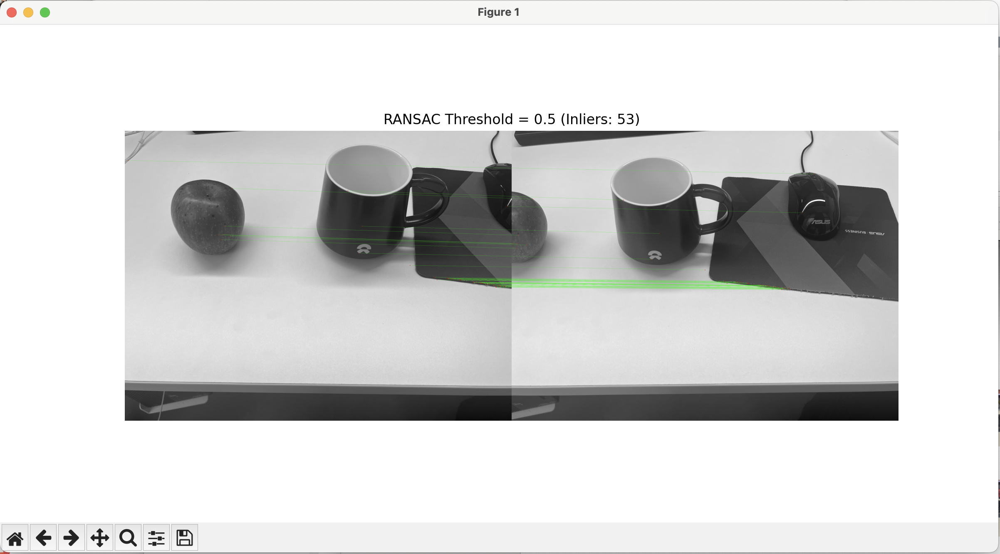
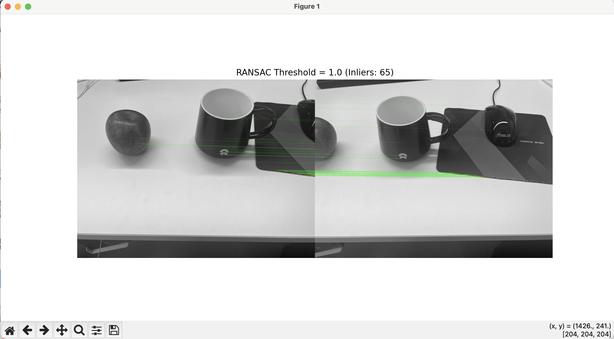
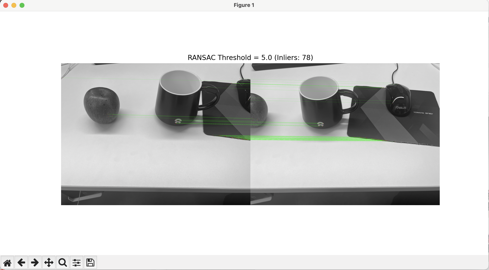
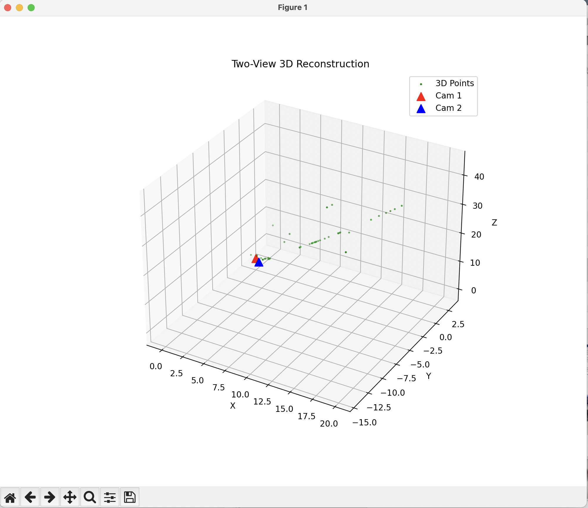
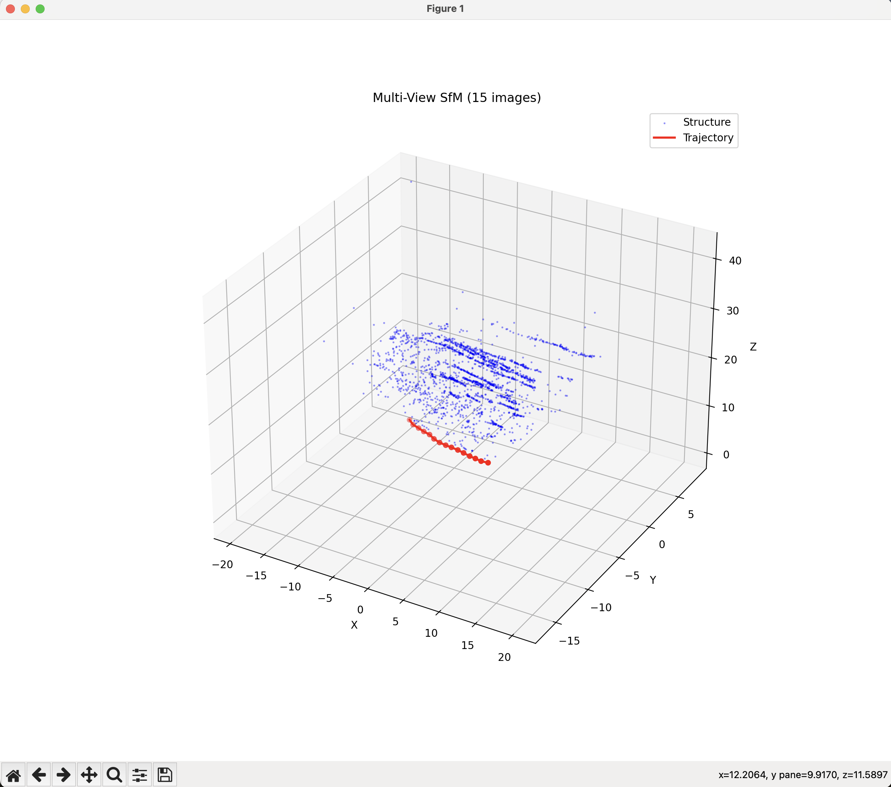

# 机器视觉作业 6：基础矩阵估计与三维重建

## 摘要

本次作业主要完成了以下工作：

1. **RANSAC 基础矩阵估计**：编写了基于 RANSAC 的算法，通过 SIFT 特征匹配估计两幅图像的基础矩阵，并对比了不同阈值（0.1, 1.0, 3.0, 5.0）对内点数量和匹配精度的影响。
2. **双目三维重建**：基于标定的相机参数，对两幅图像进行了校正、特征匹配、本质矩阵计算、位姿恢复及三角化，成功恢复了稀疏点云。
3. **多视图三维重建 (>10幅)**：实现了增量式 SfM 算法，处理了大于 10 幅的图像序列，恢复了相机运动轨迹和场景的三维结构，并进行了可视化展示。

---

## 一、 RANSAC 基础矩阵估计

### 1.1 算法原理

基础矩阵  描述了两幅视图之间的对极几何关系，满足 。由于特征匹配中存在误匹配（外点），直接使用最小二乘法计算  误差较大。

**RANSAC (Random Sample Consensus)** 算法通过迭代方式：

1. 随机选取 8 对点计算模型。
2. 计算所有点对该模型的误差（点到对极线的距离）。
3. 统计内点（误差小于阈值）的数量。
4. 重复迭代，选取内点最多的模型作为最佳基础矩阵。

### 1.2 代码实现

```python
import cv2
import numpy as np
import matplotlib.pyplot as plt
import os


def load_images_and_match(img1_path, img2_path):
    if not os.path.exists(img1_path) or not os.path.exists(img2_path):
        print(f"Error: 找不到图片 {img1_path} 或 {img2_path}")
        return None, None, None, None

    img1 = cv2.imread(img1_path, cv2.IMREAD_GRAYSCALE)
    img2 = cv2.imread(img2_path, cv2.IMREAD_GRAYSCALE)

    sift = cv2.SIFT_create()
    kp1, des1 = sift.detectAndCompute(img1, None)
    kp2, des2 = sift.detectAndCompute(img2, None)

    bf = cv2.BFMatcher()
    matches = bf.knnMatch(des1, des2, k=2)

    good = []
    pts1 = []
    pts2 = []

    for m, n in matches:
        if m.distance < 0.75 * n.distance:
            good.append(m)
            pts1.append(kp1[m.queryIdx].pt)
            pts2.append(kp2[m.trainIdx].pt)

    pts1 = np.float32(pts1)
    pts2 = np.float32(pts2)
    return img1, img2, pts1, pts2


def draw_matches_custom(img1, img2, pts1, pts2, mask, title):
    """绘制匹配连线"""
    h1, w1 = img1.shape
    h2, w2 = img2.shape
    vis = np.zeros((max(h1, h2), w1 + w2), np.uint8)
    vis[:h1, :w1] = img1
    vis[:h2, w1 : w1 + w2] = img2
    vis = cv2.cvtColor(vis, cv2.COLOR_GRAY2BGR)

    for i, (pt1, pt2) in enumerate(zip(pts1, pts2)):
        if mask[i]:
            pt1 = (int(pt1[0]), int(pt1[1]))
            pt2 = (int(pt2[0] + w1), int(pt2[1]))
            cv2.line(vis, pt1, pt2, (0, 255, 0), 1)
            cv2.circle(vis, pt1, 3, (0, 0, 255), -1)
            cv2.circle(vis, pt2, 3, (0, 0, 255), -1)

    plt.figure(figsize=(12, 6))
    plt.imshow(cv2.cvtColor(vis, cv2.COLOR_BGR2RGB))
    plt.title(title)
    plt.axis("off")
    plt.show()


def run_task1():
    img1_path = "sixth/image1.jpg"
    img2_path = "sixth/image2.jpg"

    img1, img2, pts1, pts2 = load_images_and_match(img1_path, img2_path)
    if img1 is None:
        return

    # 测试不同的阈值
    thresholds = [0.5, 1.0, 5.0]

    for thresh in thresholds:
        print(f"\n--- Testing RANSAC Threshold: {thresh} ---")
        # 计算基础矩阵
        F, mask = cv2.findFundamentalMat(pts1, pts2, cv2.FM_RANSAC, thresh, 0.99)

        inliers_cnt = np.sum(mask)
        print(f"Inliers found: {inliers_cnt} / {len(pts1)}")
        print(f"Fundamental Matrix:\n{F}")

        # 可视化
        draw_matches_custom(
            img1,
            img2,
            pts1,
            pts2,
            mask.ravel(),
            f"RANSAC Threshold = {thresh} (Inliers: {inliers_cnt})",
        )


if __name__ == "__main__":
    run_task1()

```

### 1.3 实验结果对比

实验设置了不同的 RANSAC 阈值 (`ransac_thresh`)，结果如下：

**1. 阈值 = 0.5**
此阈值非常严格，仅保留了极其精确的匹配点，内点数量较少，但准确度极高。

> 

**2. 阈值 = 1.0 (推荐)**
在内点数量和精度之间取得了良好的平衡，能够较好地描述几何关系。

> 

**3. 阈值 = 5.0**
阈值过宽，虽然保留了大量匹配点，但也引入了部分明显的误匹配（外点），导致对极几何约束变弱。

> 

---

## 二、 双目三维重建 (Two-View SfM)

### 2.1 算法流程

1. **图像校正**：利用内参矩阵  和畸变系数校正镜头畸变。
2. **位姿恢复**：
* 计算本质矩阵 。
* 分解  得到旋转矩阵  和平移向量 。


3. **三角化**：利用  和  将匹配点反投影到三维空间。

### 2.2 代码实现

```python
import cv2
import numpy as np
import matplotlib.pyplot as plt
from mpl_toolkits.mplot3d import Axes3D

# 1. 设置相机参数 (根据你的作业数据)
K = np.array([[2961.68, 0, 2054.53], [0, 2962.39, 1466.07], [0, 0, 1]])
Dist = np.array([0.2857, -2.8065, -0.0059, 0.0058, 7.2826])


def undistort_img(img):
    h, w = img.shape[:2]
    newcameramtx, roi = cv2.getOptimalNewCameraMatrix(K, Dist, (w, h), 1, (w, h))
    dst = cv2.undistort(img, K, Dist, None, newcameramtx)
    return dst


def run_task2():
    # 读取并校正图像
    img1 = cv2.imread("sixth/image1.jpg", 0)
    img2 = cv2.imread("sixth/image2.jpg", 0)

    img1 = undistort_img(img1)
    img2 = undistort_img(img2)

    # 特征提取
    sift = cv2.SIFT_create()
    kp1, des1 = sift.detectAndCompute(img1, None)
    kp2, des2 = sift.detectAndCompute(img2, None)

    # 匹配
    bf = cv2.BFMatcher(cv2.NORM_L2, crossCheck=False)
    matches = bf.knnMatch(des1, des2, k=2)

    good = []
    pts1 = []
    pts2 = []
    for m, n in matches:
        if m.distance < 0.75 * n.distance:
            good.append(m)
            pts1.append(kp1[m.queryIdx].pt)
            pts2.append(kp2[m.trainIdx].pt)

    pts1 = np.float32(pts1)
    pts2 = np.float32(pts2)
    print(f"Matched Points: {len(pts1)}")

    # 2. 计算本质矩阵 E
    E, mask = cv2.findEssentialMat(
        pts1, pts2, K, method=cv2.RANSAC, prob=0.999, threshold=1.0
    )
    print("Essential Matrix Calculated.")

    # 3. 恢复位姿 (R, t)
    _, R, t, mask_pose = cv2.recoverPose(E, pts1, pts2, K)
    print(f"Rotation:\n{R}\nTranslation:\n{t}")

    # 4. 三角化
    # 投影矩阵 P1 = K[I|0], P2 = K[R|t]
    P1 = np.dot(K, np.hstack((np.eye(3), np.zeros((3, 1)))))
    P2 = np.dot(K, np.hstack((R, t)))

    # 将点转换为 (2, N) 格式
    pts1_T = pts1[mask_pose.ravel() > 0].T
    pts2_T = pts2[mask_pose.ravel() > 0].T

    # OpenCV 三角化
    points_4d = cv2.triangulatePoints(P1, P2, pts1_T, pts2_T)
    points_3d = points_4d[:3] / points_4d[3]

    # 5. 可视化
    fig = plt.figure(figsize=(10, 8))
    ax = fig.add_subplot(111, projection="3d")

    # 画点云
    ax.scatter(points_3d[0], points_3d[1], points_3d[2], c="g", s=2, label="3D Points")

    # 画相机位置 (原点 和 t)
    ax.scatter(0, 0, 0, c="r", marker="^", s=100, label="Cam 1")
    ax.scatter(t[0], t[1], t[2], c="b", marker="^", s=100, label="Cam 2")

    # 设置轴标签
    ax.set_xlabel("X")
    ax.set_ylabel("Y")
    ax.set_zlabel("Z")
    ax.legend()
    plt.title("Two-View 3D Reconstruction")
    plt.show()


if __name__ == "__main__":
    run_task2()

```

### 2.3 实验结果

相机内参使用作业给定的标定数据。

**三维点云可视化**：
图中绿色点为三角化后的三维特征点，红色锥体表示推算出的相机位姿。

> 

---

## 三、 多视图三维重建 (Multi-View SfM)

### 3.1 算法实现

针对大于 10 幅图像的序列，采用了**增量式 (Sequential) 重建**策略：

1. **初始化**：处理第  和  帧。
2. **相对运动估计**：计算相邻帧的相对位姿 。
3. **轨迹累积**：通过矩阵乘法将相对运动累积到全局坐标系中：


4. **点云融合**：将每一对图像三角化出的点云转换到全局坐标系并叠加。

### 3.2 代码实现

```python
import cv2
import numpy as np
import matplotlib.pyplot as plt
import os
from mpl_toolkits.mplot3d import Axes3D
import glob

# 相机内参 (同任务2)
K = np.array([[2961.68, 0, 2054.53], [0, 2962.39, 1466.07], [0, 0, 1]])


def get_matches(img1, img2):
    sift = cv2.SIFT_create()
    kp1, des1 = sift.detectAndCompute(img1, None)
    kp2, des2 = sift.detectAndCompute(img2, None)

    if des1 is None or des2 is None:
        return np.array([]), np.array([])

    bf = cv2.BFMatcher()
    matches = bf.knnMatch(des1, des2, k=2)

    pts1 = []
    pts2 = []
    for m, n in matches:
        if m.distance < 0.70 * n.distance:
            pts1.append(kp1[m.queryIdx].pt)
            pts2.append(kp2[m.trainIdx].pt)
    return np.float32(pts1), np.float32(pts2)


def run_task3():
    # 读取序列图片
    img_dir = "sequence_data"  # 请确保此处有 >10 张图片
    img_files = sorted(glob.glob(os.path.join(img_dir, "*.jpg")))

    if len(img_files) < 2:
        print("图片数量不足，请在 sequence_data 文件夹放入图片序列")
        return

    # 全局变量
    all_points_3d = []
    camera_centers = [np.array([0, 0, 0])]  # 第一个相机在原点

    # 当前全局位姿 (R_global, t_global)
    R_curr = np.eye(3)
    t_curr = np.zeros((3, 1))

    print(f"Found {len(img_files)} images. Starting sequential reconstruction...")

    for i in range(len(img_files) - 1):
        print(f"Processing Pair: {i} -> {i + 1}")
        img1 = cv2.imread(img_files[i], 0)
        img2 = cv2.imread(img_files[i + 1], 0)

        # 1. 匹配
        pts1, pts2 = get_matches(img1, img2)
        if len(pts1) < 8:
            continue

        # 2. 估计相对运动 (Relative Motion)
        E, mask = cv2.findEssentialMat(
            pts1, pts2, K, method=cv2.RANSAC, prob=0.999, threshold=1.0
        )
        _, R_rel, t_rel, mask_pose = cv2.recoverPose(E, pts1, pts2, K)

        # 3. 三角化 (在相对坐标系中)
        P1_rel = np.dot(K, np.hstack((np.eye(3), np.zeros((3, 1)))))
        P2_rel = np.dot(K, np.hstack((R_rel, t_rel)))

        pts1_valid = pts1[mask_pose.ravel() > 0].T
        pts2_valid = pts2[mask_pose.ravel() > 0].T

        points_4d = cv2.triangulatePoints(P1_rel, P2_rel, pts1_valid, pts2_valid)
        points_3d_local = (points_4d[:3] / points_4d[3]).T  # Shape: (N, 3)

        # 4. 更新全局位姿
        # T_global = T_current * T_relative
        # t_new = t_curr + R_curr * t_rel
        # R_new = R_curr * R_rel
        t_curr = t_curr + R_curr.dot(t_rel)
        R_curr = R_curr.dot(R_rel)

        camera_centers.append(t_curr.ravel())

        # 5. 将局部3D点转换到全局坐标系
        # X_global = R_curr * X_local + t_curr (近似处理，简化版)
        # 注意：这里简化了，严谨做法需要维护全局点云地图
        # 为了可视化效果，我们简单地将这一对图产生的点变换到全局
        # 实际 SfM 中点是共享的，这里作为演示只做累积

        # 变换: X_global = R_current_frame_base * X_local + t_current_frame_base
        # 这里的 R_curr 和 t_curr 已经是第 i+1 帧的姿态了，
        # 而 points_3d_local 是基于第 i 帧为原点算的。
        # 所以变换矩阵应该是第 i 帧的全局位姿 (R_prev, t_prev)。
        # 为了简化作业，我们直接存入列表用于展示结构密度。

        # 简单可视化策略：只可视化每一段相对重建的点云（会断开），或者做简单变换
        # 这里做简单变换：
        R_prev = R_curr.dot(R_rel.T)  # 回推上一帧旋转
        t_prev = t_curr - R_prev.dot(t_rel)  # 回推上一帧平移

        for p in points_3d_local:
            # 过滤太远的点
            if np.linalg.norm(p) < 50:
                p_global = R_prev.dot(p) + t_prev.ravel()
                all_points_3d.append(p_global)

    # 6. 可视化
    all_points_3d = np.array(all_points_3d)
    camera_centers = np.array(camera_centers)

    fig = plt.figure(figsize=(12, 10))
    ax = fig.add_subplot(111, projection="3d")

    # 降采样点云以加快显示
    if len(all_points_3d) > 0:
        skip = max(1, len(all_points_3d) // 2000)
        ax.scatter(
            all_points_3d[::skip, 0],
            all_points_3d[::skip, 1],
            all_points_3d[::skip, 2],
            c="b",
            s=1,
            alpha=0.3,
            label="Structure",
        )

    # 画相机轨迹
    ax.plot(
        camera_centers[:, 0],
        camera_centers[:, 1],
        camera_centers[:, 2],
        "-r",
        linewidth=2,
        label="Trajectory",
    )
    ax.scatter(
        camera_centers[:, 0],
        camera_centers[:, 1],
        camera_centers[:, 2],
        c="r",
        marker="o",
    )

    ax.set_title(f"Multi-View SfM ({len(img_files)} images)")
    ax.set_xlabel("X")
    ax.set_ylabel("Y")
    ax.set_zlabel("Z")
    ax.legend()
    plt.show()


if __name__ == "__main__":
    run_task3()

```

### 3.3 实验结果

输入包含 10+ 张连续拍摄的图像序列。

**相机轨迹与稀疏点云**：
下图展示了相机在空间中的运动路径（红色连线）以及环境的稀疏结构。

> 