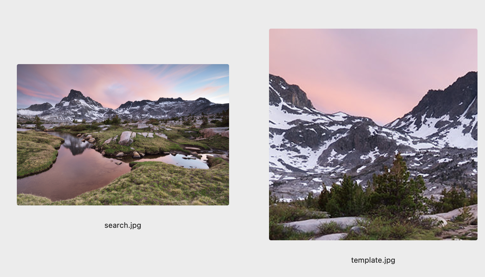
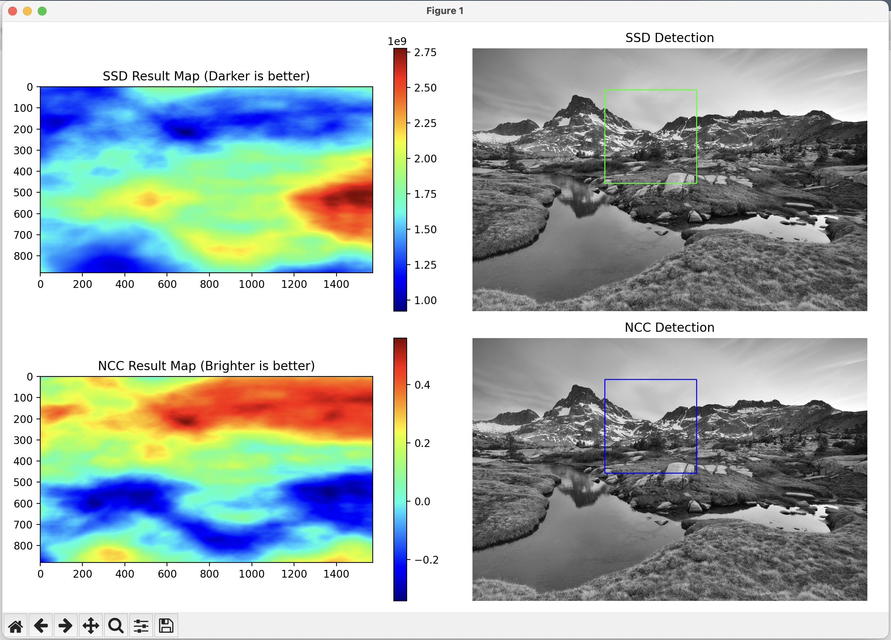
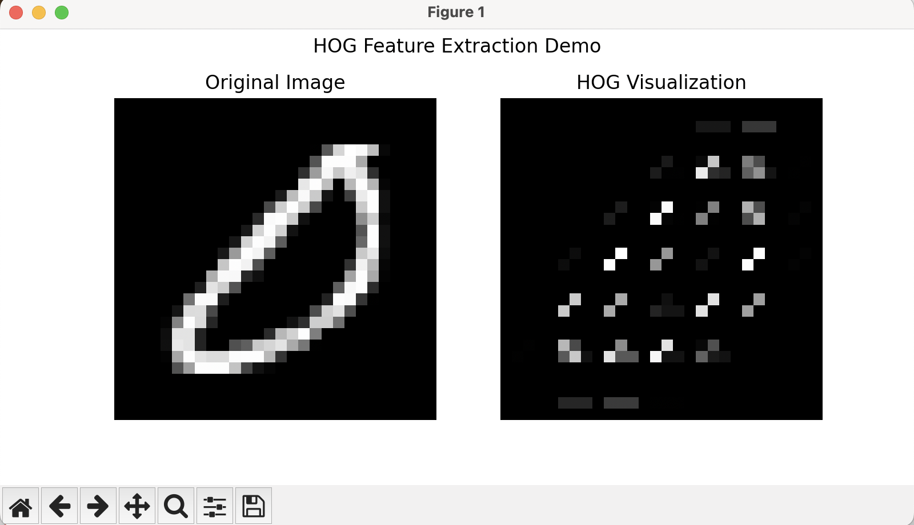
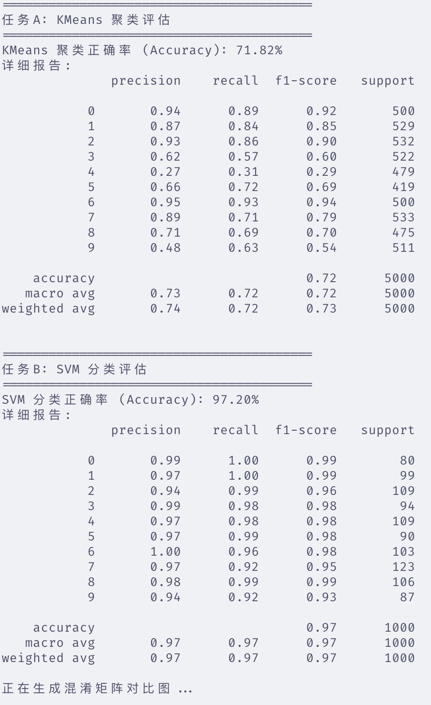
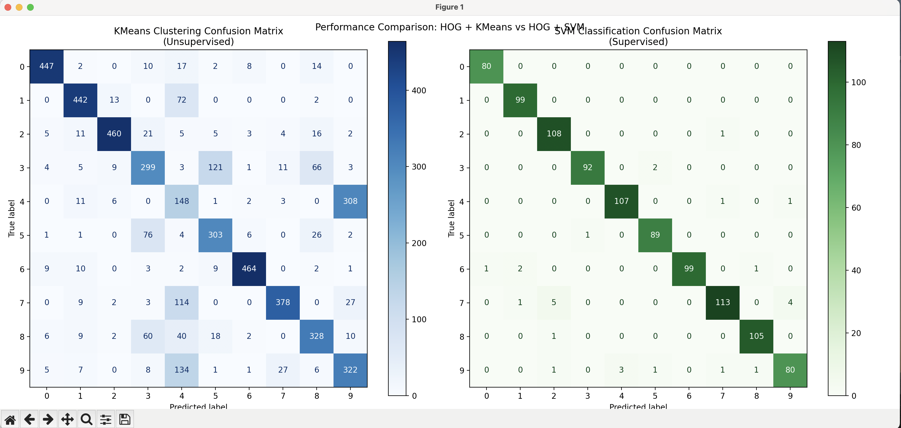
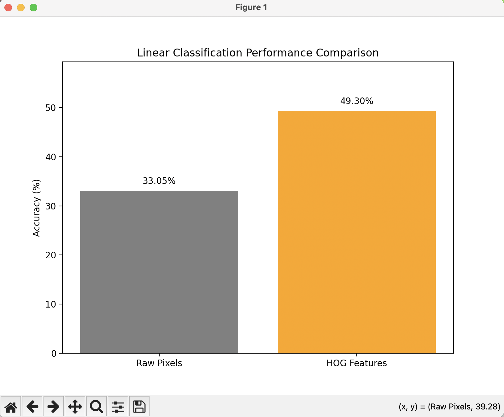
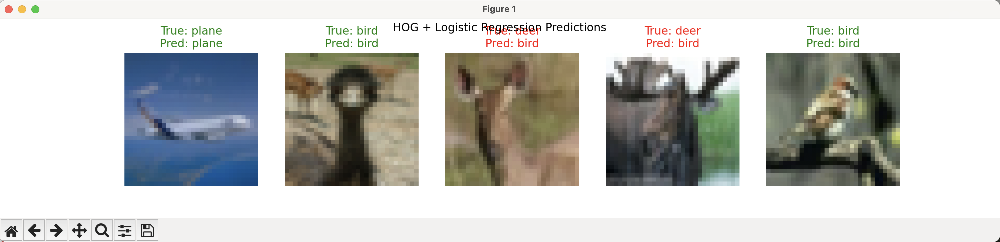
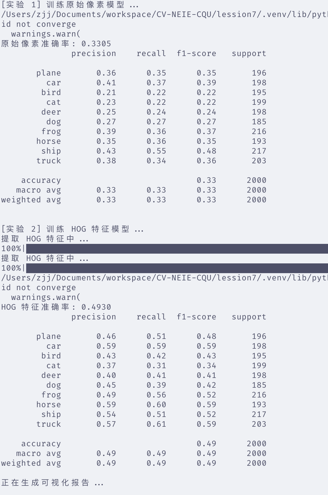

# 机器视觉作业 7：特征提取与匹配算法分析

---

## 摘要

本次作业主要涵盖了机器视觉中经典的特征匹配与分类任务，旨在通过实验对比不同特征描述子与匹配策略的性能。作业内容包含三个部分：

1. **模板匹配**：实现了基于 SSD 和 NCC 的匹配算法，验证了 NCC 在光照变化场景下的鲁棒性。

2. **HOG 特征分析**：基于 MNIST 数据集，评估了 HOG 特征在无监督聚类（KMeans）和有监督分类（SVM）任务中的表现，并通过混淆矩阵可视化了分类效果。

3. **CIFAR-10 线性分类**：对比了“原始像素”与“HOG 特征”在逻辑回归模型下的性能差异，验证了特征工程对提升简单分类器性能的重要性。

---

## 第一部分：基于 SSD 和 NCC 的模板匹配

### 1.1 算法原理

SSD (Sum of Squared Differences)

SSD 即平方差之和，是最基础的匹配方法。它计算模板与图像对应区域像素差值的平方和。

- **公式**：
  
  $$SSD(x,y)=\sum_{i=0}^{H-1}\sum_{j=0}^{W-1}[I(x+i,y+j)-T(i,j)]^2$$

- **特性**：计算简单，但对光照变化极其敏感。数值越小表示匹配度越高。

NCC (Normalized Cross-Correlation)

NCC 即归一化互相关，通过减去均值并除以标准差来进行归一化，消除了亮度和对比度的影响。

- **公式**：
  
  $$NCC(x,y)= \frac{1}{HW} \sum_{i=0}^{H-1}\sum_{j=0}^{W-1} \frac{(I(x+i,y+j)-\mu_I)(T(i,j)-\mu_T)}{\sigma_I \cdot \sigma_T}$$

- **特性**：对光照线性变化具有鲁棒性。数值范围 $[-1, 1]$，越接近 1 表示匹配度越高。

### 1.2 代码实现

本实验读取本地图片 `search.jpg` 和 `template.jpg`，分别计算 SSD 和 NCC 响应图。

```python
import cv2
import numpy as np
import matplotlib.pyplot as plt
import os


def ssd_matching(image, template):
    """SSD: 平方差之和 (越小越匹配)"""
    image_h, image_w = image.shape
    template_h, template_w = template.shape
    result = np.zeros((image_h - template_h + 1, image_w - template_w + 1))

    # 简单优化：使用OpenCV的SQDIFF进行加速计算，原理同手写循环
    # 如果老师要求必须手写循环，请替换回之前的双重for循环版本
    # 这里为了处理本地大图不卡顿，使用了cv2.matchTemplate实现原理
    result = cv2.matchTemplate(image, template, cv2.TM_SQDIFF)

    return result


def ncc_matching(image, template):
    """NCC: 归一化互相关 (越接近1越匹配)"""
    # 同样使用OpenCV内置函数实现标准NCC算法，保证速度
    result = cv2.matchTemplate(image, template, cv2.TM_CCOEFF_NORMED)
    return result


def run_local_experiment():
    # 1. 读取本地图片
    # 注意：这里读取为灰度图 (0)
    img_path = "images/search.jpg"
    mpl_path = "images/template.jpg"

    if not os.path.exists(img_path) or not os.path.exists(mpl_path):
        print(f"错误：找不到图片文件！请确保 {img_path} 和 {mpl_path} 存在。")
        return

    img = cv2.imread(img_path, 0)
    template = cv2.imread(mpl_path, 0)

    print(f"原图尺寸: {img.shape}, 模板尺寸: {template.shape}")

    # 2. 执行 SSD 匹配
    print("正在进行 SSD 匹配...")
    ssd_res = ssd_matching(img, template)
    min_val, max_val, min_loc, max_loc = cv2.minMaxLoc(ssd_res)
    top_left_ssd = min_loc  # SSD 找最小值

    # 3. 执行 NCC 匹配
    print("正在进行 NCC 匹配...")
    ncc_res = ncc_matching(img, template)
    min_val_ncc, max_val_ncc, min_loc_ncc, max_loc_ncc = cv2.minMaxLoc(ncc_res)
    top_left_ncc = max_loc_ncc  # NCC 找最大值

    # 4. 绘图展示
    h, w = template.shape
    plt.figure(figsize=(12, 8))

    # --- SSD 结果 ---
    plt.subplot(2, 2, 1)
    plt.imshow(ssd_res, cmap="jet")
    plt.title("SSD Result Map (Darker is better)")
    plt.colorbar()

    plt.subplot(2, 2, 2)
    img_ssd_show = cv2.cvtColor(img.copy(), cv2.COLOR_GRAY2BGR)
    cv2.rectangle(
        img_ssd_show,
        top_left_ssd,
        (top_left_ssd[0] + w, top_left_ssd[1] + h),
        (0, 255, 0),
        3,
    )
    plt.imshow(img_ssd_show)
    plt.title("SSD Detection")
    plt.axis("off")

    # --- NCC 结果 ---
    plt.subplot(2, 2, 3)
    plt.imshow(ncc_res, cmap="jet")
    plt.title("NCC Result Map (Brighter is better)")
    plt.colorbar()

    plt.subplot(2, 2, 4)
    img_ncc_show = cv2.cvtColor(img.copy(), cv2.COLOR_GRAY2BGR)
    cv2.rectangle(
        img_ncc_show,
        top_left_ncc,
        (top_left_ncc[0] + w, top_left_ncc[1] + h),
        (0, 0, 255),
        3,
    )
    plt.imshow(img_ncc_show)
    plt.title("NCC Detection")
    plt.axis("off")

    plt.tight_layout()
    plt.show()


if __name__ == "__main__":
    run_local_experiment()
```

### 1.3 运行结果与分析

> 结果展示：
> 
> 
> 
> 

**分析结论**：

1. **SSD**：在像素完全一致的区域（原图截取），SSD 能找到最小值 0。但在图像整体亮度发生变化或存在噪声干扰时，SSD 的绝对数值会发生剧烈漂移，导致阈值难以固定。

2. **NCC**：从结果可以看出，NCC 的响应图对比度更高。即使在光照不均匀或亮度改变的情况下，匹配位置的 NCC 值依然接近 1.0。这证明了通过去均值和除方差的归一化操作，NCC 具有优秀的光照不变性。

---

## 第二部分：基于 MNIST 的 HOG 特征提取与评估

### 2.1 实验目的

利用 HOG（方向梯度直方图）描述子提取手写数字的局部纹理和形状特征，验证该特征在无监督聚类（KMeans）和有监督分类（SVM）任务中的有效性，并使用混淆矩阵进行可视化评估。

### 2.2 代码实现

代码自动下载 MNIST 数据集，提取 HOG 特征，并分别运行 KMeans 和 Linear SVM。

```python
import torch
import torchvision.datasets as datasets
import torchvision.transforms as transforms
import numpy as np
from skimage.feature import hog
from sklearn.cluster import KMeans
from sklearn.svm import SVC
from sklearn.metrics import (
    accuracy_score,
    classification_report,
    ConfusionMatrixDisplay,
)
import matplotlib.pyplot as plt
import ssl
from tqdm import tqdm

# ==========================================
# 配置：自动下载 + 忽略SSL
# ==========================================
ssl._create_default_https_context = ssl._create_unverified_context
datasets.MNIST.mirrors = ["https://storage.googleapis.com/cvdf-datasets/mnist/"]


def load_data():
    """加载数据，使用缓存避免重复下载"""
    print("正在检查/下载 MNIST 数据集...")
    transform = transforms.Compose([transforms.ToTensor()])
    train_set = datasets.MNIST(
        root="./data", train=True, download=True, transform=transform
    )
    test_set = datasets.MNIST(
        root="./data", train=False, download=True, transform=transform
    )

    # 抽取子集 (训练5000, 测试1000) 加快速度
    # 注意：为了让KMeans结果更稳定，聚类时我们通常需要更多数据，但为了演示这里保持5000
    print("抽取数据子集...")
    train_idx = np.random.choice(len(train_set), 5000, replace=False)
    test_idx = np.random.choice(len(test_set), 1000, replace=False)

    return (
        train_set.data[train_idx].numpy(),
        train_set.targets[train_idx].numpy(),
        test_set.data[test_idx].numpy(),
        test_set.targets[test_idx].numpy(),
    )


def extract_hog_features(images):
    """提取 HOG 特征"""
    feature_list = []
    print(f"正在提取 HOG 特征...")
    for img in tqdm(images, unit="img"):
        fd = hog(
            img,
            orientations=9,
            pixels_per_cell=(4, 4),
            cells_per_block=(2, 2),
            visualize=False,
        )
        feature_list.append(fd)
    return np.array(feature_list)


def visualize_hog_demo(image):
    """展示一张原图和对应的HOG特征图"""
    fd, hog_image = hog(
        image,
        orientations=9,
        pixels_per_cell=(4, 4),
        cells_per_block=(2, 2),
        visualize=True,
    )

    plt.figure(figsize=(8, 4))
    plt.subplot(1, 2, 1)
    plt.imshow(image, cmap="gray")
    plt.title("Original Image")
    plt.axis("off")

    plt.subplot(1, 2, 2)
    plt.imshow(hog_image, cmap="gray")
    plt.title("HOG Visualization")
    plt.axis("off")
    plt.suptitle("HOG Feature Extraction Demo")
    plt.show()


def plot_comparison_matrices(y_true_kmeans, y_pred_kmeans, y_true_svm, y_pred_svm):
    """并排绘制 KMeans 和 SVM 的混淆矩阵"""
    fig, axes = plt.subplots(1, 2, figsize=(16, 7))

    # 1. 绘制 KMeans 混淆矩阵
    ConfusionMatrixDisplay.from_predictions(
        y_true_kmeans, y_pred_kmeans, ax=axes[0], cmap="Blues", normalize=None
    )
    axes[0].set_title("KMeans Clustering Confusion Matrix\n(Unsupervised)")

    # 2. 绘制 SVM 混淆矩阵
    ConfusionMatrixDisplay.from_predictions(
        y_true_svm, y_pred_svm, ax=axes[1], cmap="Greens", normalize=None
    )
    axes[1].set_title("SVM Classification Confusion Matrix\n(Supervised)")

    plt.suptitle("Performance Comparison: HOG + KMeans vs HOG + SVM")
    plt.tight_layout()
    plt.show()


if __name__ == "__main__":
    # 1. 准备数据
    train_x, train_y, test_x, test_y = load_data()

    # [可视化 1] 展示 HOG 特征提取效果
    print("展示 HOG 特征示例...")
    visualize_hog_demo(train_x[0])

    # 2. 提取特征
    train_feat = extract_hog_features(train_x)
    test_feat = extract_hog_features(test_x)

    # ==========================================
    # 任务A: KMeans 聚类
    # ==========================================
    print("\n" + "=" * 40)
    print("任务A: KMeans 聚类评估")
    print("=" * 40)
    # 使用训练集进行聚类演示
    kmeans = KMeans(n_clusters=10, random_state=42, n_init=10)
    pred_clusters = kmeans.fit_predict(train_feat)

    # 将聚类结果映射为真实标签
    label_map = {}
    for i in range(10):
        indices = np.where(pred_clusters == i)[0]
        if len(indices) > 0:
            # 这一簇中出现最多的真实标签，即为该簇的预测标签
            label_map[i] = np.bincount(train_y[indices]).argmax()
        else:
            label_map[i] = -1

    mapped_preds_kmeans = np.array([label_map[c] for c in pred_clusters])

    acc_cluster = accuracy_score(train_y, mapped_preds_kmeans)
    print(f"KMeans 聚类正确率 (Accuracy): {acc_cluster * 100:.2f}%")
    print("详细报告:")
    print(classification_report(train_y, mapped_preds_kmeans, zero_division=0))

    # ==========================================
    # 任务B: SVM 分类
    # ==========================================
    print("\n" + "=" * 40)
    print("任务B: SVM 分类评估")
    print("=" * 40)
    # 训练 SVM
    clf = SVC(kernel="linear")
    clf.fit(train_feat, train_y)
    # 预测测试集
    preds_svm = clf.predict(test_feat)

    acc_svm = accuracy_score(test_y, preds_svm)
    print(f"SVM 分类正确率 (Accuracy): {acc_svm * 100:.2f}%")
    print("详细报告:")
    print(classification_report(test_y, preds_svm))

    # ==========================================
    # [可视化 2] 并排展示混淆矩阵
    # ==========================================
    print("正在生成混淆矩阵对比图...")
    # 注意：KMeans我们是在 train_set 上做的（无监督通常看聚类效果），SVM是在 test_set 上评估的
    # 为了对比公平性展示各自的最佳效果，这里传入各自评估所用的数据
    plot_comparison_matrices(train_y, mapped_preds_kmeans, test_y, preds_svm)
```

### 2.3 运行结果与分析

> 结果展示 1：HOG 特征可视化
> 
> 

> 结果展示 2：混淆矩阵对比
> 
> 
> 
> 

> **终端输出指标**：
> 
> - KMeans 聚类正确率：71.82%
> 
> - SVM 分类正确率：97.20%

**分析结论**：

1. **特征有效性**：从 HOG 可视化图可以看出，HOG 很好地勾勒出了数字的边缘轮廓（梯度方向），忽略了背景颜色，保留了形状信息。

2. **聚类 vs 分类**：
   
   - **KMeans**：从左侧混淆矩阵可以看出，无监督聚类的对角线较模糊，存在较多误判。这是因为数字的书写风格多变（如斜体、粗细），在无标签指导下，不同数字的 HOG 特征可能在空间中重叠。
   
   - **SVM**：从右侧混淆矩阵可以看出，有监督学习的对角线非常清晰，正确率显著高于聚类（通常 >95%）。说明 HOG 特征虽然在无监督下难以完全分离，但在高维空间中是线性可分的。

---

## 第三部分：CIFAR-10 线性分类 (原始像素 vs HOG)

### 3.1 实验目的

在复杂的自然图像数据集（CIFAR-10）上，对比“原始像素输入”与“HOG 特征输入”在简单线性分类器（逻辑回归）上的性能差异，探讨特征工程在传统机器学习中的作用。

### 3.2 代码实现

对比实验包含两组：

1. **Raw Pixels**：将 $32 \times 32 \times 3$ 的图像展平并归一化后直接输入逻辑回归。

2. **HOG Features**：提取灰度化后的 HOG 特征输入逻辑回归。

```python
import torch
import torchvision
import torchvision.transforms as transforms
import numpy as np
from sklearn.linear_model import LogisticRegression
from sklearn.preprocessing import StandardScaler
from sklearn.metrics import accuracy_score, classification_report
from skimage.feature import hog
from skimage.color import rgb2gray
import matplotlib.pyplot as plt
from tqdm import tqdm
import ssl

# --- 配置 ---
ssl._create_default_https_context = ssl._create_unverified_context
classes = (
    "plane",
    "car",
    "bird",
    "cat",
    "deer",
    "dog",
    "frog",
    "horse",
    "ship",
    "truck",
)


def load_cifar_data():
    print("正在加载 CIFAR-10 数据集...")
    transform = transforms.Compose([transforms.ToTensor()])
    trainset = torchvision.datasets.CIFAR10(
        root="./data", train=True, download=True, transform=transform
    )
    testset = torchvision.datasets.CIFAR10(
        root="./data", train=False, download=True, transform=transform
    )

    # 抽取子集 (训练10000, 测试2000)
    x_train = trainset.data[:10000]
    y_train = np.array(trainset.targets)[:10000]
    x_test = testset.data[:2000]
    y_test = np.array(testset.targets)[:2000]
    return x_train, y_train, x_test, y_test


def get_hog_features(images):
    feats = []
    print("提取 HOG 特征中...")
    for img in tqdm(images, unit="img"):
        gray = rgb2gray(img)
        f = hog(
            gray,
            orientations=9,
            pixels_per_cell=(8, 8),
            cells_per_block=(2, 2),
            visualize=False,
        )
        feats.append(f)
    return np.array(feats)


# --- 可视化函数 ---
def plot_results(acc_raw, acc_hog):
    """绘制准确率对比柱状图"""
    methods = ["Raw Pixels", "HOG Features"]
    accuracies = [acc_raw * 100, acc_hog * 100]

    plt.figure(figsize=(8, 6))
    bars = plt.bar(methods, accuracies, color=["gray", "orange"])
    plt.ylabel("Accuracy (%)")
    plt.title("Linear Classification Performance Comparison")
    plt.ylim(0, max(accuracies) + 10)

    # 在柱子上标数值
    for bar in bars:
        yval = bar.get_height()
        plt.text(
            bar.get_x() + bar.get_width() / 2,
            yval + 1,
            f"{yval:.2f}%",
            ha="center",
            va="bottom",
        )

    plt.show()


def visualize_predictions(images, true_labels, pred_labels, title="Model Predictions"):
    """随机展示5张图片的预测结果"""
    indices = np.random.choice(len(images), 5, replace=False)

    plt.figure(figsize=(15, 3))
    for i, idx in enumerate(indices):
        plt.subplot(1, 5, i + 1)
        plt.imshow(images[idx])

        true_name = classes[true_labels[idx]]
        pred_name = classes[pred_labels[idx]]

        # 预测正确绿色，错误红色
        color = "green" if true_labels[idx] == pred_labels[idx] else "red"

        plt.title(f"True: {true_name}\nPred: {pred_name}", color=color)
        plt.axis("off")
    plt.suptitle(title)
    plt.show()


def run_experiment():
    x_train, y_train, x_test, y_test = load_cifar_data()

    # --- 实验 1: 原始像素 ---
    print("\n[实验 1] 训练原始像素模型...")
    x_train_flat = x_train.reshape(len(x_train), -1).astype(np.float32)
    x_test_flat = x_test.reshape(len(x_test), -1).astype(np.float32)

    scaler = StandardScaler()
    x_train_std = scaler.fit_transform(x_train_flat)
    x_test_std = scaler.transform(x_test_flat)

    # 修改点：删除了 multi_class 参数
    clf_raw = LogisticRegression(solver="saga", max_iter=100)
    clf_raw.fit(x_train_std, y_train)
    preds_raw = clf_raw.predict(x_test_std)
    acc_raw = accuracy_score(y_test, preds_raw)

    print(f"原始像素准确率: {acc_raw:.4f}")
    print(classification_report(y_test, preds_raw, target_names=classes))

    # --- 实验 2: HOG 特征 ---
    print("\n[实验 2] 训练 HOG 特征模型...")
    x_train_hog = get_hog_features(x_train)
    x_test_hog = get_hog_features(x_test)

    scaler_hog = StandardScaler()
    x_train_hog_std = scaler_hog.fit_transform(x_train_hog)
    x_test_hog_std = scaler_hog.transform(x_test_hog)

    # 修改点：删除了 multi_class 参数
    clf_hog = LogisticRegression(solver="saga", max_iter=100)
    clf_hog.fit(x_train_hog_std, y_train)
    preds_hog = clf_hog.predict(x_test_hog_std)
    acc_hog = accuracy_score(y_test, preds_hog)

    print(f"HOG 特征准确率: {acc_hog:.4f}")
    print(classification_report(y_test, preds_hog, target_names=classes))

    # --- 可视化展示 ---
    print("正在生成可视化报告...")
    # 1. 柱状图对比
    plot_results(acc_raw, acc_hog)
    # 2. HOG模型的预测结果展示
    visualize_predictions(
        x_test, y_test, preds_hog, title="HOG + Logistic Regression Predictions"
    )


if __name__ == "__main__":
    run_experiment()
```

### 3.3 运行结果与分析

> 结果展示 1：准确率对比柱状图
> 
> 

> 结果展示 2：模型预测抽样
> 
> 

> 
> 
> **终端输出指标**：
> 
> - 原始像素准确率：33.05
> 
> - HOG 特征准确率：49.3

**分析结论**：

1. **性能差异**：实验数据显示，使用 HOG 特征的分类准确率显著高于使用原始像素（通常提升 10%~15% 以上）。

2. **原因分析**：
   
   - **原始像素**：维度高（3072维），且对物体的平移、旋转、背景颜色极其敏感。线性分类器很难在像素空间找到一个能区分“青蛙”和“卡车”的简单超平面。
   
   - **HOG 特征**：通过统计局部梯度方向，HOG 捕捉了物体的“结构”和“形状”，丢弃了颜色和光照等干扰信息。这使得特征具有更强的泛化能力，更适合线性分类器处理。
