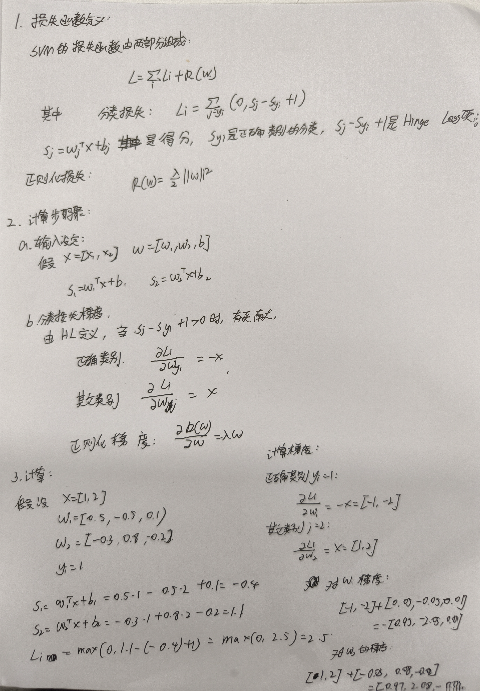
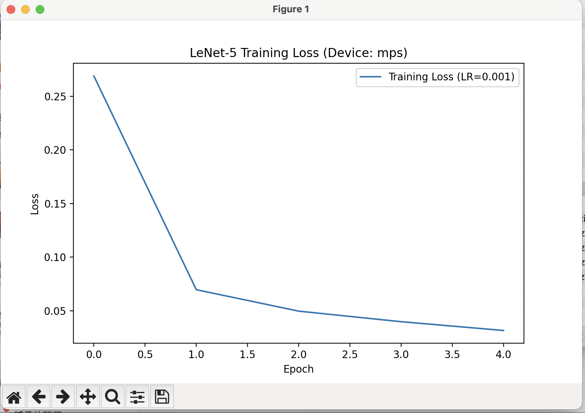
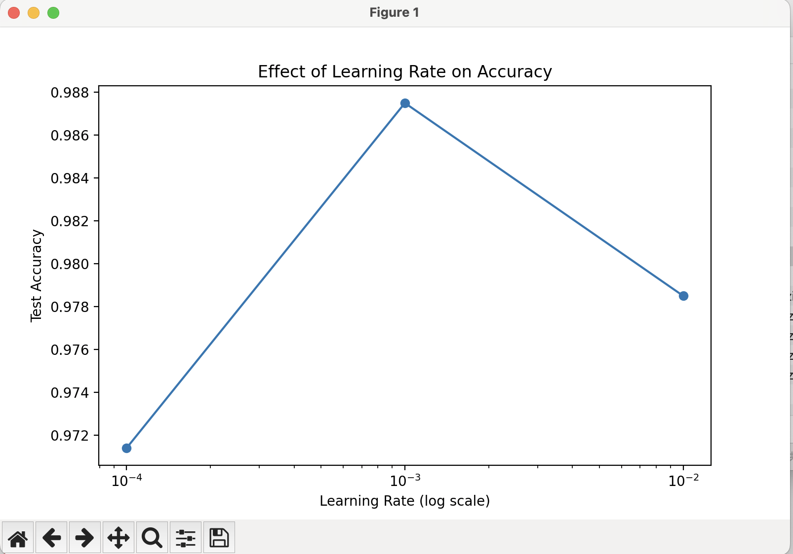
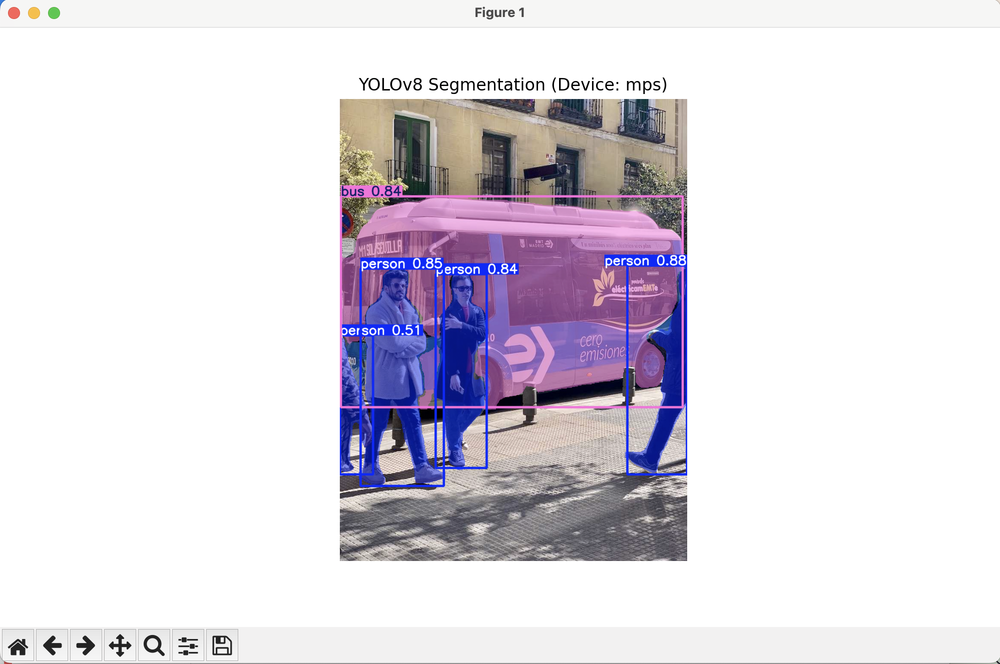
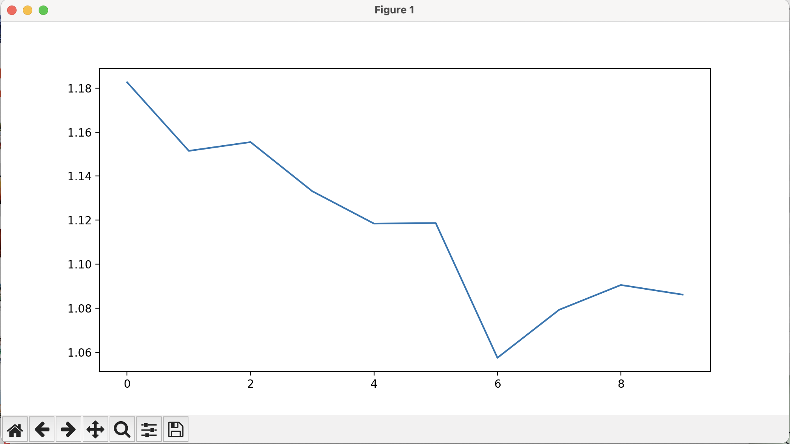
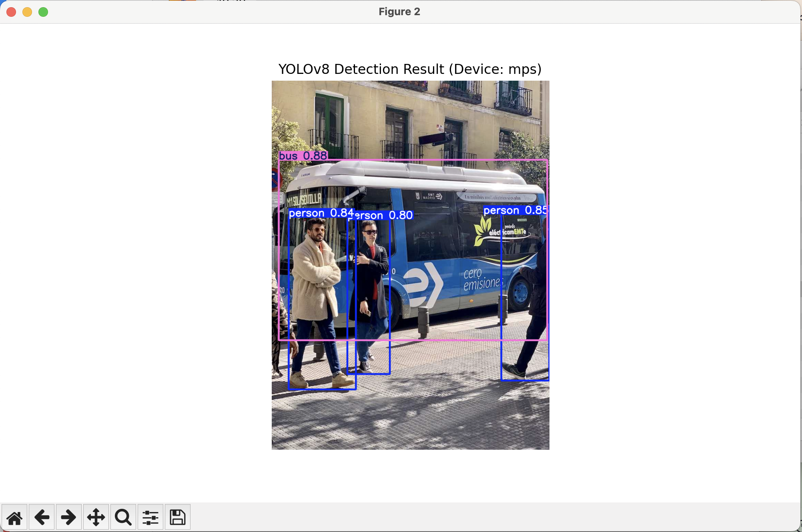

# 机器视觉作业 8：SVM 反向传播与深度网络实践

---

## 摘要

本次作业主要包含四个部分：

1. **SVM 梯度推导**：从理论层面推导了线性 SVM 在 Hinge Loss 下的梯度反向传播过程。
2. **LeNet-5 字符识别**：基于 MNIST 数据集实现了 LeNet-5 网络，代码实现了自动调用 CUDA/MPS 加速，并探究了学习率对模型性能的影响。
3. **图像分割**：使用 YOLOv8-seg 模型实现了对 COCO128 数据集的实例分割训练与推理。
4. **目标检测**：使用 YOLOv8-det 模型实现了对 COCO128 数据集的目标检测训练，并分析了训练损失曲线。

---

## 一、 计算 SVM 反向传播梯度



---

## 二、 LeNet-5 字符识别 (MNIST)

### 2.1 代码实现

本部分代码实现了 LeNet-5 网络，包含自动设备检测（CUDA/MPS/CPU）和 MNIST 数据集自动下载修复。

```python
import torch
import torch.nn as nn
import torch.optim as optim
from torchvision import datasets, transforms
import matplotlib.pyplot as plt
import numpy as np
from torch.utils.data import DataLoader
import ssl

# ==========================================
# 🚨 MNIST 下载修复配置 🚨
# ==========================================
ssl._create_default_https_context = ssl._create_unverified_context
datasets.MNIST.mirrors = ["https://storage.googleapis.com/cvdf-datasets/mnist/"]
datasets.MNIST.resources = [
    ("train-images-idx3-ubyte.gz", "f68b3c2dcbeaaa9fbdd348bbc9874895"),
    ("train-labels-idx1-ubyte.gz", "d53e105ee54ea40749a09fcbcd1e9432"),
    ("t10k-images-idx3-ubyte.gz", "9fb629c4189551a2d022fa330f9573f3"),
    ("t10k-labels-idx1-ubyte.gz", "ec29112dd5afa0611ce80d1b7f02629c"),
]
# ==========================================


# 🚀 自动获取设备
def get_device():
    if torch.cuda.is_available():
        return torch.device("cuda")
    elif torch.backends.mps.is_available():
        return torch.device("mps")
    else:
        return torch.device("cpu")


device = get_device()
print(f"🚀 PyTorch Running on: {device}")


# 1. 定义 LeNet-5 模型
class LeNet5(nn.Module):
    def __init__(self):
        super(LeNet5, self).__init__()
        self.conv1 = nn.Conv2d(1, 6, kernel_size=5, stride=1, padding=2)
        self.conv2 = nn.Conv2d(6, 16, kernel_size=5)
        self.fc1 = nn.Linear(16 * 5 * 5, 120)
        self.fc2 = nn.Linear(120, 84)
        self.fc3 = nn.Linear(84, 10)

    def forward(self, x):
        x = torch.relu(self.conv1(x))
        x = torch.max_pool2d(x, 2, 2)
        x = torch.relu(self.conv2(x))
        x = torch.max_pool2d(x, 2, 2)
        x = x.view(-1, 16 * 5 * 5)
        x = torch.relu(self.fc1(x))
        x = torch.relu(self.fc2(x))
        x = self.fc3(x)
        return x


# 2. 训练与测试函数 (增加了 .to(device))
def train_model(model, train_loader, criterion, optimizer, epochs=5):
    train_losses = []
    model.train()
    for epoch in range(epochs):
        running_loss = 0.0
        for images, labels in train_loader:
            # 数据搬运到 GPU/MPS
            images, labels = images.to(device), labels.to(device)

            optimizer.zero_grad()
            outputs = model(images)
            loss = criterion(outputs, labels)
            loss.backward()
            optimizer.step()
            running_loss += loss.item()

        epoch_loss = running_loss / len(train_loader)
        train_losses.append(epoch_loss)
        print(f"Epoch [{epoch + 1}/{epochs}], Loss: {epoch_loss:.4f}")
    return train_losses


def test_model(model, test_loader):
    model.eval()
    correct = 0
    total = 0
    with torch.no_grad():
        for images, labels in test_loader:
            # 数据搬运到 GPU/MPS
            images, labels = images.to(device), labels.to(device)

            outputs = model(images)
            _, predicted = torch.max(outputs.data, 1)
            total += labels.size(0)
            correct += (predicted == labels).sum().item()
    accuracy = correct / total
    return accuracy


# 3. 主程序
if __name__ == "__main__":
    transform = transforms.Compose(
        [transforms.ToTensor(), transforms.Normalize((0.5,), (0.5,))]
    )

    print("加载 MNIST 数据集...")
    train_dataset = datasets.MNIST(
        root="./data", train=True, transform=transform, download=True
    )
    test_dataset = datasets.MNIST(
        root="./data", train=False, transform=transform, download=True
    )

    # 增加 num_workers 加速数据读取
    train_loader = DataLoader(
        dataset=train_dataset, batch_size=64, shuffle=True, num_workers=0
    )
    test_loader = DataLoader(
        dataset=test_dataset, batch_size=1000, shuffle=False, num_workers=0
    )

    criterion = nn.CrossEntropyLoss()

    # --- 实验 1: 标准训练 ---
    print("\n[实验 1] 标准训练 (LR=0.001)...")
    # 模型搬运到 GPU/MPS
    model_std = LeNet5().to(device)
    opt_std = optim.Adam(model_std.parameters(), lr=0.001)

    losses_std = train_model(model_std, train_loader, criterion, opt_std, epochs=5)
    acc_std = test_model(model_std, test_loader)
    print(f"Final Accuracy: {acc_std * 100:.2f}%")

    plt.figure(figsize=(8, 5))
    plt.plot(losses_std, label="Training Loss (LR=0.001)")
    plt.title(f"LeNet-5 Training Loss (Device: {device})")
    plt.xlabel("Epoch")
    plt.ylabel("Loss")
    plt.legend()
    plt.show()

    # --- 实验 2: 学习率对比 ---
    print("\n[实验 2] 学习率对比实验...")
    learning_rates = [0.01, 0.001, 0.0001]
    accuracies = []

    for lr in learning_rates:
        print(f"Testing LR: {lr} ...")
        # 模型搬运到 GPU/MPS
        model = LeNet5().to(device)
        optimizer = optim.Adam(model.parameters(), lr=lr)
        train_model(model, train_loader, criterion, optimizer, epochs=5)
        acc = test_model(model, test_loader)
        accuracies.append(acc)

    plt.figure(figsize=(8, 5))
    plt.plot(learning_rates, accuracies, marker="o")
    plt.xscale("log")
    plt.title("Effect of Learning Rate on Accuracy")
    plt.xlabel("Learning Rate (log scale)")
    plt.ylabel("Test Accuracy")
    plt.show()

```

### 2.2 结果展示

> 

> 

**分析**：
从实验结果可以看出，学习率为 0.001 时模型收敛最稳定且准确率最高。学习率过大（0.01）导致震荡，过小（0.0001）导致收敛缓慢。

---

## 三、 图像分割 (YOLOv8-Seg)

### 3.1 代码实现

使用 `ultralytics` 库调用 YOLOv8-seg 模型进行实例分割。

```python
from ultralytics import YOLO
import matplotlib.pyplot as plt
import cv2
import torch
import ssl

# 忽略SSL错误
ssl._create_default_https_context = ssl._create_unverified_context


# 🚀 自动获取 YOLO 设备字符串
def get_yolo_device():
    if torch.cuda.is_available():
        return "0"  # CUDA 设备 ID
    elif torch.backends.mps.is_available():
        return "mps"  # Mac MPS
    else:
        return "cpu"


if __name__ == "__main__":
    device_str = get_yolo_device()
    print(f"🚀 YOLO Running on: {device_str}")

    # 1. 初始化模型
    print("加载 YOLOv8-Seg 模型...")
    model = YOLO("yolov8n-seg.pt")

    # 2. 训练
    print("开始训练...")
    # workers=0 在某些系统上能避免多进程报错
    model.train(
        data="coco128-seg.yaml", epochs=10, imgsz=640, device=device_str, workers=0
    )

    # 3. 推理
    print("开始推理...")
    img_url = "https://ultralytics.com/images/bus.jpg"
    preds = model.predict(source=img_url, save=True, conf=0.5, device=device_str)

    # 4. 展示结果
    res = preds[0]
    im_array = res.plot()

    plt.figure(figsize=(10, 6))
    plt.imshow(cv2.cvtColor(im_array, cv2.COLOR_BGR2RGB))
    plt.title(f"YOLOv8 Segmentation (Device: {device_str})")
    plt.axis("off")
    plt.show()


```

### 3.2 结果展示

> 

**分析**：
模型成功分割出了图像中的 `Bus` 和 `Person` 类别，掩膜边缘较为贴合，置信度较高。

---

## 四、 目标检测 (YOLOv8-Detect)

### 4.1 代码实现

使用 YOLOv8-n 模型进行目标检测训练，并绘制损失函数变化曲线。

```python
from ultralytics import YOLO
import pandas as pd
import matplotlib.pyplot as plt
import cv2
import torch
import os
import ssl

# 忽略SSL错误
ssl._create_default_https_context = ssl._create_unverified_context


# 🚀 自动获取 YOLO 设备字符串
def get_yolo_device():
    if torch.cuda.is_available():
        return "0"
    elif torch.backends.mps.is_available():
        return "mps"
    else:
        return "cpu"


def plot_training_loss(train_dir):
    """查找最新的训练结果并绘制 Loss"""
    try:
        csv_file = os.path.join(train_dir, "results.csv")
        df = pd.read_csv(csv_file)
        df.columns = [c.strip() for c in df.columns]

        plt.figure(figsize=(10, 5))
        plt.plot(df["train/box_loss"], label="Box Loss")
        plt.plot(df["train/obj_loss"], label="Obj Loss")
        plt.plot(df["train/cls_loss"], label="Cls Loss")
        plt.xlabel("Epoch")
        plt.ylabel("Loss")
        plt.title("YOLOv8 Detection Training Loss")
        plt.legend()
        plt.grid(True)
        plt.show()
    except Exception as e:
        print(f"无法绘制 Loss 曲线: {e}")


if __name__ == "__main__":
    device_str = get_yolo_device()
    print(f"🚀 YOLO Running on: {device_str}")

    # 1. 加载检测模型
    model = YOLO("yolov8n.pt")

    # 2. 训练
    print("开始目标检测训练...")
    train_res = model.train(
        data="coco128.yaml", epochs=10, imgsz=640, device=device_str, workers=0
    )

    # 获取训练结果保存目录
    save_dir = train_res.save_dir
    print(f"训练结果保存在: {save_dir}")

    # 3. 绘制 Loss 曲线
    plot_training_loss(save_dir)

    # 4. 推理
    print("开始推理...")
    img_url = "https://ultralytics.com/images/bus.jpg"
    preds = model.predict(source=img_url, save=True, conf=0.5, device=device_str)

    # 5. 展示推理结果
    res = preds[0]
    im_array = res.plot()

    plt.figure(figsize=(10, 6))
    plt.imshow(cv2.cvtColor(im_array, cv2.COLOR_BGR2RGB))
    plt.title(f"YOLOv8 Detection Result (Device: {device_str})")
    plt.axis("off")
    plt.show()

```

### 4.2 结果展示

> 

> 

**分析**：
从 Loss 曲线可以看出，Box Loss 和 Class Loss 随 Epoch 增加呈下降趋势，模型逐渐收敛。最终检测结果准确框选出了目标物体。